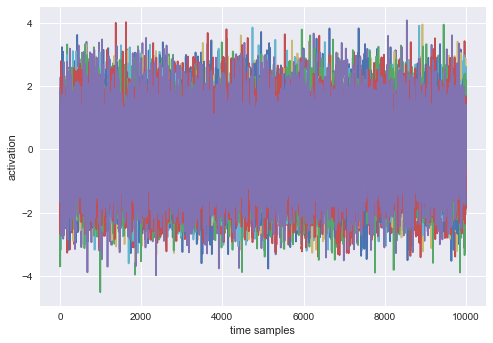
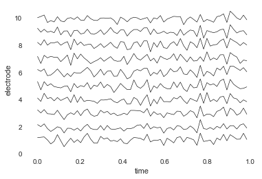
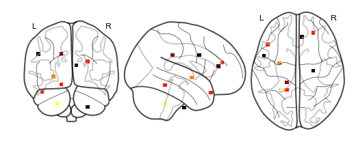

Building a brain object
=======================

Brain objects are supereeg’s fundamental data structure for a single
subject’s iEEG data. To create one at minimum you’ll need a matrix of
neural recordings (time samples by electrodes), electrode locations, and
a sample rate. Additionally, you can include information about separate
recording sessions and store custom meta data. In this tutorial, we’ll
build a brain object from scratch and get familiar with some of the
methods.

Load in the required libraries
==============================

.. code:: ipython2

    import warnings 
    warnings.simplefilter("ignore")
    %matplotlib inline
    import supereeg as se
    import numpy as np

Simulate some data
==================

First, we’ll use supereeg’s built in simulation functions to simulate
some data and electrodes. By default, the ``simulate_data`` function
will return a 1000 samples by 10 electrodes matrix, but you can specify
the number of time samples with ``n_samples`` and the number of
electrodes with ``n_elecs``. If you want further information on
simulating data, check out the simulate tutorial!

.. code:: ipython2

    # simulate some data
    bo_data = se.simulate_bo(n_samples=1000, sessions=2, n_elecs=10)
    
    # plot it
    bo_data.plot_data()
    
    # get just data
    data = bo_data.get_data()

We’ll also simulate some electrode locations

.. code:: ipython2

    locs = se.simulate_locations()
    print(locs)

.. parsed-literal::

        x   y   z
    0 -49 -12  20
    1 -47 -39 -48
    2 -37  -6  43
    3 -35 -36   3
    4  17 -48 -18
    5  18 -18  35
    6  30 -22 -18
    7  31   4   5
    8  31   7  21
    9  46  24 -19

Creating a brain object
=======================

To construct a new brain objects, simply pass the data and locations to
the ``Brain`` class like this:

.. code:: ipython2

    bo = se.Brain(data=data, locs=locs, sample_rate=100)

To view a summary of the contents of the brain object, you can call the
``info`` function:

.. code:: ipython2

    bo.info()

.. parsed-literal::

    Number of electrodes: 10
    Recording time in seconds: [10.]
    Sample Rate in Hz: [100]
    Number of sessions: 1
    Date created: Thu Mar  8 10:41:57 2018
    Meta data: {}

Optionally, you can pass a ``sessions`` parameter, which is can be a
numpy array or list the length of your data with a unique identifier for
each session. For example:

.. code:: ipython2

    sessions = np.array([1]*(data.shape[0]/2)+[2]*(data.shape[0]/2))
    bo = se.Brain(data=data, locs=locs, sample_rate=1000, sessions=sessions)
    bo.info()

.. parsed-literal::

    Number of electrodes: 10
    Recording time in seconds: [0.5 0.5]
    Sample Rate in Hz: [1000, 1000]
    Number of sessions: 2
    Date created: Thu Mar  8 10:41:57 2018
    Meta data: {}

You can also pass add custom meta data to the brain object to help keep
track of its contents. ``meta`` is a dictionary comprised of whatever
you want:

.. code:: ipython2

    meta = {
        'subjectID' : '123',
        'Investigator' : 'Andy',
        'Hospital' : 'DHMC'
    }
    bo = se.Brain(data=data, locs=locs, sample_rate=1000, sessions=sessions, meta=meta)
    bo.info()

.. parsed-literal::

    Number of electrodes: 10
    Recording time in seconds: [0.5 0.5]
    Sample Rate in Hz: [1000, 1000]
    Number of sessions: 2
    Date created: Thu Mar  8 10:41:57 2018
    Meta data: {'Hospital': 'DHMC', 'subjectID': '123', 'Investigator': 'Andy'}

Initialize brain objects
========================

Brain objects can be initialized by passing a brain object (ending in
``.bo``), but can also be initialized with a model object or nifti
object by specifying ``return_type`` as ``bo`` in the load function.

For example, you can load a nifti object as a brain object:

.. code:: ipython2

    se.load('example_nifti', return_type='bo')

.. parsed-literal::

    <supereeg.brain.Brain at 0x11552a250>

The structure of a brain object
===============================

Inside the brain object, the iEEG data is stored as a Pandas DataFrame
that can be accessed directly:

.. code:: ipython2

    bo.data.head()

.. raw:: html

    

    
    <table border="1" class="dataframe">
      <thead>
        <tr style="text-align: right;">
          <th></th>
          <th>0</th>
          <th>1</th>
          <th>2</th>
          <th>3</th>
          <th>4</th>
          <th>5</th>
          <th>6</th>
          <th>7</th>
          <th>8</th>
          <th>9</th>
        </tr>
      </thead>
      <tbody>
        <tr>
          <th>0</th>
          <td>0.567270</td>
          <td>1.571735</td>
          <td>0.687147</td>
          <td>-0.806358</td>
          <td>0.386306</td>
          <td>0.503631</td>
          <td>-1.669945</td>
          <td>-0.105044</td>
          <td>0.223022</td>
          <td>1.148812</td>
        </tr>
        <tr>
          <th>1</th>
          <td>0.393624</td>
          <td>0.483532</td>
          <td>0.814324</td>
          <td>-0.603827</td>
          <td>-0.597659</td>
          <td>0.037127</td>
          <td>-0.978627</td>
          <td>-0.298726</td>
          <td>-0.192210</td>
          <td>-0.175140</td>
        </tr>
        <tr>
          <th>2</th>
          <td>1.022924</td>
          <td>0.524780</td>
          <td>0.910607</td>
          <td>-0.277372</td>
          <td>0.554604</td>
          <td>0.318984</td>
          <td>-0.641164</td>
          <td>-0.353763</td>
          <td>0.279058</td>
          <td>0.375646</td>
        </tr>
        <tr>
          <th>3</th>
          <td>-0.580082</td>
          <td>-0.249284</td>
          <td>-0.038028</td>
          <td>-0.690756</td>
          <td>-0.691062</td>
          <td>-0.349361</td>
          <td>-0.315365</td>
          <td>-0.633677</td>
          <td>-0.557212</td>
          <td>-0.434741</td>
        </tr>
        <tr>
          <th>4</th>
          <td>0.270530</td>
          <td>0.522444</td>
          <td>0.455709</td>
          <td>1.028060</td>
          <td>1.076976</td>
          <td>0.435147</td>
          <td>1.251693</td>
          <td>0.870343</td>
          <td>0.423300</td>
          <td>0.346171</td>
        </tr>
      </tbody>
    </table>
    

or returned as a numpy array using the ``get_data`` method:

.. code:: ipython2

    bo.get_data()

.. parsed-literal::

    array([[ 0.56726994,  1.5717352 ,  0.68714678, ..., -0.10504354,
             0.22302192,  1.14881205],
           [ 0.39362446,  0.48353157,  0.81432427, ..., -0.29872572,
            -0.19221047, -0.17513971],
           [ 1.02292373,  0.52478022,  0.91060691, ..., -0.35376295,
             0.27905833,  0.37564592],
           ...,
           [-0.18653459, -0.0035791 , -0.60695455, ..., -0.26821   ,
            -0.57499093, -0.2657185 ],
           [ 0.3211099 ,  1.74675948,  0.41327613, ..., -0.98191572,
            -0.42069791,  0.57161526],
           [-0.35578489, -0.14550246, -0.46235317, ..., -0.63510035,
            -0.68559669, -0.76856951]])

Similarly, the electrode locations are stored as a Pandas DataFrame, and
can be retrieved as a numpy array using the ``get_locs`` method:

.. code:: ipython2

    bo.locs.head()

.. raw:: html

    

    
    <table border="1" class="dataframe">
      <thead>
        <tr style="text-align: right;">
          <th></th>
          <th>x</th>
          <th>y</th>
          <th>z</th>
        </tr>
      </thead>
      <tbody>
        <tr>
          <th>0</th>
          <td>-49</td>
          <td>-12</td>
          <td>20</td>
        </tr>
        <tr>
          <th>1</th>
          <td>-47</td>
          <td>-39</td>
          <td>-48</td>
        </tr>
        <tr>
          <th>2</th>
          <td>-37</td>
          <td>-6</td>
          <td>43</td>
        </tr>
        <tr>
          <th>3</th>
          <td>-35</td>
          <td>-36</td>
          <td>3</td>
        </tr>
        <tr>
          <th>4</th>
          <td>17</td>
          <td>-48</td>
          <td>-18</td>
        </tr>
      </tbody>
    </table>
    

.. code:: ipython2

    bo.get_locs()

.. parsed-literal::

    array([[-49, -12,  20],
           [-47, -39, -48],
           [-37,  -6,  43],
           [-35, -36,   3],
           [ 17, -48, -18],
           [ 18, -18,  35],
           [ 30, -22, -18],
           [ 31,   4,   5],
           [ 31,   7,  21],
           [ 46,  24, -19]])

You can also pass a list of indices for either ``times`` or ``locs`` and
return a subset of the brain object

.. code:: ipython2

    bo_s = bo.get_slice(sample_inds=[1,2,3], loc_inds=[1,2,3])
    bo_s.get_data()

.. parsed-literal::

    array([[ 0.48353157,  0.81432427, -0.60382666],
           [ 0.52478022,  0.91060691, -0.27737183],
           [-0.24928399, -0.03802751, -0.6907561 ]])

You can resample your data by specifying a new resample rate

.. code:: ipython2

    bo.resample(64)

You can also plot both the data and the electrode locations:

.. code:: ipython2

    bo.plot_data()

.. code:: ipython2

    bo.plot_locs()

The other pieces of the brain object are listed below:

.. code:: ipython2

    # array of session identifiers for each timepoint
    sessions = bo.sessions
    
    # number of sessions
    n_sessions = bo.n_sessions
    
    # sample rate
    sample_rate = bo.sample_rate
    
    # number of electrodes
    n_elecs = bo.n_elecs
    
    # length of each recording session in seconds
    n_seconds = bo.n_secs
    
    # the date and time that the bo was created
    date_created = bo.date_created
    
    # kurtosis of each electrode
    kurtosis = bo.kurtosis
    
    # meta data
    meta = bo.meta
    
    # label delinieating observed and reconstructed locations
    label = bo.label

Brain object methods
====================

There are a few other useful methods on a brain object

``bo.info()``
-------------

This method will give you a summary of the brain object:

.. code:: ipython2

    bo.info()

.. parsed-literal::

    Number of electrodes: 10
    Recording time in seconds: [0.5 0.5]
    Sample Rate in Hz: [64, 64]
    Number of sessions: 2
    Date created: Thu Mar  8 10:41:57 2018
    Meta data: {'Hospital': 'DHMC', 'subjectID': '123', 'Investigator': 'Andy'}

``bo.get_data()``
-----------------

.. code:: ipython2

    data_array = bo.get_data()

``bo.get_zscore_data()``
------------------------

This method will return a numpy array of the zscored data:

.. code:: ipython2

    zdata_array = bo.get_zscore_data()

``bo.get_locs()``
-----------------

This method will return a numpy array of the electrode locations:

.. code:: ipython2

    locs = bo.get_locs()

``bo.get_slice()``
------------------

This method allows you to slice out time and locations from the brain
object, and returns a brain object. This can occur in place if you set
the flag ``inplace=True``.

.. code:: ipython2

    bo_slice = bo.get_slice(sample_inds=None, loc_inds=None, inplace=False)

``bo.resample()``
-----------------

This method allows you resample a brain object in place.

.. code:: ipython2

    bo.resample(resample_rate=None)

.. parsed-literal::

    <supereeg.brain.Brain at 0x1166f5210>

``bo.plot_data()``
------------------

This method normalizes and plots data from brain object:

.. code:: ipython2

    bo.plot_data()

.. image:: brain_objects_files/brain_objects_47_0.png

``bo.plot_locs()``
------------------

This method plots electrode locations from brain object:

.. code:: ipython2

    bo.plot_locs()

``bo.save(fname='something')``
------------------------------

This method will save the brain object to the specified file location.
The data will be saved as a ‘bo’ file, which is a dictionary containing
the elements of a brain object saved in the hd5 format using
``deepdish``.

.. code:: ipython2

    #bo.save(fname='brain_object')

``bo.to_nii()``
---------------

This method converts the brain object into a ``nibabel`` nifti image. If
``filepath`` is specified, the nifti file will be saved. You can also
specify a nifti template with the ``template`` argument. If no template
is specified, it will use the gray matter masked MNI 152 brain
downsampled to 6mm.

.. code:: ipython2

    # convert to nifti
    nii = bo.to_nii()
    
    # plot first timepoint
    nii.plot_glass_brain()
    
    # save the file
    # nii = bo.to_nii(filepath='/path/to/file/brain')
    
    # specify a template and resolution
    # nii = bo.to_nii(template='/path/to/nifti/file.nii', vox_size=20)

