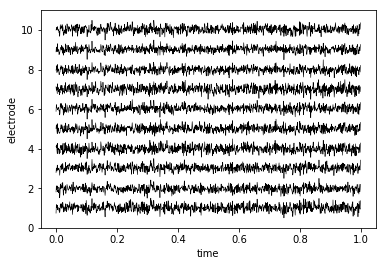
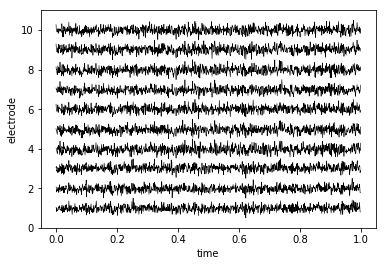
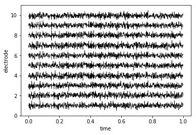
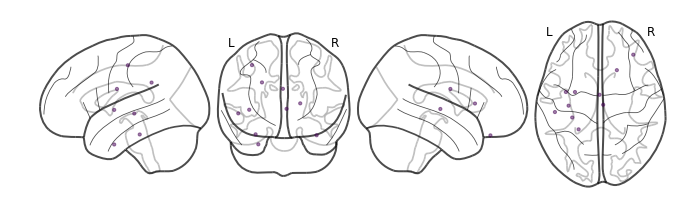

Building a brain object
=======================

Brain objects are supereeg’s fundamental data structure for a single
subject’s iEEG data. To create one at minimum you’ll need a matrix of
neural recordings (time samples by electrodes), electrode locations, and
a sample rate. Additionally, you can include information about separate
recording sessions and store custom meta data. In this tutorial, we’ll
build a brain object from scratch and get familiar with some of the
methods.

Load in the required libraries
==============================

.. code:: ipython2

    import supereeg as se
    import numpy as np
    import seaborn as sns
    import matplotlib.pyplot as plt

.. parsed-literal::

    /Library/Python/2.7/site-packages/sklearn/cross_validation.py:44: DeprecationWarning: This module was deprecated in version 0.18 in favor of the model_selection module into which all the refactored classes and functions are moved. Also note that the interface of the new CV iterators are different from that of this module. This module will be removed in 0.20.
      "This module will be removed in 0.20.", DeprecationWarning)

Simulate some data
==================

First, we’ll use supereeg’s built in simulation functions to simulate
some data and electrodes. By default, the ``simualate_data`` function
will return a 1000 samples by 10 electrodes matrix, but you can specify
the number of time samples with ``n_samples`` and the number of
electrodes with ``n_elecs``. If you want further information on
simulating data, check out the simulate tutorial!

.. code:: ipython2

    # simulate some data
    data = se.simulate_bo(n_samples=1000, sessions=2, n_elecs=10).get_data()
    
    # plot it
    plt.plot(data)
    plt.xlabel('time samples')
    plt.ylabel('activation')
    plt.show()

.. image:: brain_objects_files/brain_objects_4_0.png

We’ll also simulate some electrode locations

.. code:: ipython2

    locs = se.simulate_locations()
    print(locs)

.. parsed-literal::

        x   y   z
    0   8  12   2
    1  21  -4  14
    2 -21 -45  46
    3   0  48 -32
    4  -6  48  10
    5   5 -12 -28
    6  40  26 -45
    7  47  46  31
    8  41  32  -2
    9  36  46 -50

Creating a brain object
=======================

To construct a new brain objects, simply pass the data and locations to
the ``Brain`` class like this:

.. code:: ipython2

    bo = se.Brain(data=data, locs=locs, sample_rate=100)

To view a summary of the contents of the brain object, you can call the
``info`` function:

.. code:: ipython2

    bo.info()

.. parsed-literal::

    Number of electrodes: 10
    Recording time in seconds: [ 10.]
    Number of sessions: 1
    Date created: Tue Feb  6 16:20:13 2018
    Meta data: None

Optionally, you can pass a ``sessions`` parameter, which is can be a
numpy array or list the length of your data with a unique identifier for
each session. For example:

.. code:: ipython2

    sessions = np.array([1]*(data.shape[0]/2)+[2]*(data.shape[0]/2))
    bo = se.Brain(data=data, locs=locs, sample_rate=1000, sessions=sessions)
    bo.info()

.. parsed-literal::

    Number of electrodes: 10
    Recording time in seconds: [ 0.5  0.5]
    Number of sessions: 2
    Date created: Tue Feb  6 16:20:14 2018
    Meta data: None

You can also pass add custom meta data to the brain object to help keep
track of its contents. ``meta`` is a dictionary comprised of whatever
you want:

.. code:: ipython2

    meta = {
        'subjectID' : '123',
        'Investigator' : 'Andy',
        'Hospital' : 'DHMC'
    }
    bo = se.Brain(data=data, locs=locs, sample_rate=1000, sessions=sessions, meta=meta)
    bo.info()

.. parsed-literal::

    Number of electrodes: 10
    Recording time in seconds: [ 0.5  0.5]
    Number of sessions: 2
    Date created: Tue Feb  6 16:20:14 2018
    Meta data: {'Hospital': 'DHMC', 'subjectID': '123', 'Investigator': 'Andy'}

The structure of a brain object
===============================

Inside the brain object, the iEEG data is stored as a Pandas DataFrame
that can be accessed directly:

.. code:: ipython2

    bo.data.head()

.. raw:: html

    

    
    <table border="1" class="dataframe">
      <thead>
        <tr style="text-align: right;">
          <th></th>
          <th>0</th>
          <th>1</th>
          <th>2</th>
          <th>3</th>
          <th>4</th>
          <th>5</th>
          <th>6</th>
          <th>7</th>
          <th>8</th>
          <th>9</th>
        </tr>
      </thead>
      <tbody>
        <tr>
          <th>0</th>
          <td>0.252570</td>
          <td>-0.366939</td>
          <td>0.684694</td>
          <td>0.957669</td>
          <td>0.666361</td>
          <td>-0.114054</td>
          <td>0.686640</td>
          <td>0.653504</td>
          <td>1.016141</td>
          <td>0.484182</td>
        </tr>
        <tr>
          <th>1</th>
          <td>-0.210420</td>
          <td>-0.085350</td>
          <td>-0.057978</td>
          <td>-0.043887</td>
          <td>0.482282</td>
          <td>0.018661</td>
          <td>-0.041541</td>
          <td>0.268207</td>
          <td>0.452813</td>
          <td>-0.238761</td>
        </tr>
        <tr>
          <th>2</th>
          <td>-0.932930</td>
          <td>-1.319492</td>
          <td>-1.133959</td>
          <td>-0.121640</td>
          <td>-0.162533</td>
          <td>-0.735879</td>
          <td>0.344255</td>
          <td>-0.263569</td>
          <td>-0.314684</td>
          <td>-0.820860</td>
        </tr>
        <tr>
          <th>3</th>
          <td>-1.740057</td>
          <td>-1.427032</td>
          <td>-1.263509</td>
          <td>-0.675289</td>
          <td>-0.138340</td>
          <td>-1.212840</td>
          <td>-0.967628</td>
          <td>-0.322346</td>
          <td>-0.378017</td>
          <td>-0.811070</td>
        </tr>
        <tr>
          <th>4</th>
          <td>-0.670612</td>
          <td>-0.024611</td>
          <td>-0.247474</td>
          <td>-0.307456</td>
          <td>-0.466172</td>
          <td>-0.585884</td>
          <td>-0.418812</td>
          <td>-0.000488</td>
          <td>-0.180712</td>
          <td>-0.725203</td>
        </tr>
      </tbody>
    </table>
    

or returned as a numpy array using the ``get_data`` method:

.. code:: ipython2

    bo.get_data()

.. parsed-literal::

    array([[ 0.25256986, -0.3669388 ,  0.68469381, ...,  0.6535038 ,
             1.01614149,  0.48418235],
           [-0.21041969, -0.08534968, -0.05797836, ...,  0.26820668,
             0.45281284, -0.23876076],
           [-0.93293045, -1.31949205, -1.13395929, ..., -0.26356947,
            -0.31468436, -0.82085981],
           ..., 
           [ 0.01567011, -0.10208274, -0.67698072, ..., -0.84384726,
            -0.70301835, -0.88451175],
           [ 1.2337753 ,  0.82156787,  1.04550738, ...,  0.06066858,
             0.98351383,  0.72137955],
           [-1.07785269, -0.53987624, -0.33094716, ...,  0.5368813 ,
             0.41121487, -0.69807546]])

Similarly, the electrode locations are stored as a Pandas DataFrame, and
can be retrieved as a numpy array using the ``get_locs`` method:

.. code:: ipython2

    bo.locs.head()

.. raw:: html

    

    
    <table border="1" class="dataframe">
      <thead>
        <tr style="text-align: right;">
          <th></th>
          <th>x</th>
          <th>y</th>
          <th>z</th>
        </tr>
      </thead>
      <tbody>
        <tr>
          <th>0</th>
          <td>8</td>
          <td>12</td>
          <td>2</td>
        </tr>
        <tr>
          <th>1</th>
          <td>21</td>
          <td>-4</td>
          <td>14</td>
        </tr>
        <tr>
          <th>2</th>
          <td>-21</td>
          <td>-45</td>
          <td>46</td>
        </tr>
        <tr>
          <th>3</th>
          <td>0</td>
          <td>48</td>
          <td>-32</td>
        </tr>
        <tr>
          <th>4</th>
          <td>-6</td>
          <td>48</td>
          <td>10</td>
        </tr>
      </tbody>
    </table>
    

.. code:: ipython2

    bo.get_locs()

.. parsed-literal::

    array([[  8,  12,   2],
           [ 21,  -4,  14],
           [-21, -45,  46],
           [  0,  48, -32],
           [ -6,  48,  10],
           [  5, -12, -28],
           [ 40,  26, -45],
           [ 47,  46,  31],
           [ 41,  32,  -2],
           [ 36,  46, -50]])

You can also plot both the data and the electrode locations:

.. code:: ipython2

    bo.plot_data()
    plt.show()

.. parsed-literal::

    /Users/lucyowen/repos/superEEG/supereeg/brain.py:268: MatplotlibDeprecationWarning: The set_axis_bgcolor function was deprecated in version 2.0. Use set_facecolor instead.
      ax.set_axis_bgcolor('w')

.. code:: ipython2

    bo.plot_locs()

.. parsed-literal::

    /Library/Python/2.7/site-packages/matplotlib/cbook.py:136: MatplotlibDeprecationWarning: The axisbg attribute was deprecated in version 2.0. Use facecolor instead.
      warnings.warn(message, mplDeprecation, stacklevel=1)
    /Library/Python/2.7/site-packages/nilearn/plotting/glass_brain.py:164: MatplotlibDeprecationWarning: The get_axis_bgcolor function was deprecated in version 2.0. Use get_facecolor instead.
      black_bg = colors.colorConverter.to_rgba(ax.get_axis_bgcolor()) \
    /Library/Python/2.7/site-packages/nilearn/plotting/displays.py:1259: FutureWarning: elementwise comparison failed; returning scalar instead, but in the future will perform elementwise comparison
      if node_color == 'auto':

The other pieces of the brain object are listed below:

.. code:: ipython2

    # array of session identifiers for each timepoint
    sessions = bo.sessions
    
    # number of sessions
    n_sessions = bo.n_sessions
    
    # sample rate
    sample_rate = bo.sample_rate
    
    # number of electrodes
    n_elecs = bo.n_elecs
    
    # length of each recording session in seconds
    n_seconds = bo.n_secs
    
    # the date and time that the bo was created
    date_created = bo.date_created
    
    # kurtosis of each electrode
    kurtosis = bo.kurtosis
    
    # meta data
    meta = bo.meta
    
    # label delinieating observed and reconstructed locations
    label = bo.label

Brain object methods
====================

There are a few other useful methods on a brain object

``bo.info()``
-------------

This method will give you a summary of the brain object:

.. code:: ipython2

    bo.info()

.. parsed-literal::

    Number of electrodes: 10
    Recording time in seconds: [ 0.5  0.5]
    Number of sessions: 2
    Date created: Tue Feb  6 16:20:14 2018
    Meta data: {'Hospital': 'DHMC', 'subjectID': '123', 'Investigator': 'Andy'}

``bo.get_data()``
-----------------

.. code:: ipython2

    data_array = bo.get_data()

``bo.get_zscore_data()``
------------------------

This method will return a numpy array of the zscored data:

.. code:: ipython2

    zdata_array = bo.get_zscore_data()

``bo.get_locs()``
-----------------

This method will return a numpy array of the electrode locations:

.. code:: ipython2

    locs = bo.get_locs()

``bo.plot_data()``
------------------

This method normalizes and plots data from brain object:

.. code:: ipython2

    bo.plot_data()

``bo.plot_locs()``
------------------

This method plots electrode locations from brain object:

.. code:: ipython2

    bo.plot_locs()

``bo.save(fname='something')``
------------------------------

This method will save the brain object to the specified file location.
The data will be saved as a ‘bo’ file, which is a dictionary containing
the elements of a brain object saved in the hd5 format using
``deepdish``.

.. code:: ipython2

    #bo.save(fname='brain_object')

``bo.to_nii()``
---------------

This method converts the brain object into a ``nibabel`` nifti image. If
``filepath`` is specified, the nifti file will be saved. You can also
specify a nifti template with the ``template`` argument.

.. code:: ipython2

    nii = bo.to_nii()
    print(type(nii))
    
    # save the file
    # nii = bo.to_nii(filepath='/path/to/file/brain')
    
    # specify a template
    # nii = bo.to_nii(template='/path/to/nifti/file.nii')

.. parsed-literal::

    <class 'nibabel.nifti1.Nifti1Image'>

.. parsed-literal::

    /Users/lucyowen/repos/superEEG/supereeg/brain.py:366: UserWarning: Voxel sizes of reconstruction and template do not match. Default to using a template with 20mm voxels.
      warnings.warn('Voxel sizes of reconstruction and template do not match. '
    /Users/lucyowen/repos/superEEG/supereeg/brain.py:387: UserWarning: Voxel sizes of reconstruction and template do not match. Voxel sizes calculated from model locations.
      warnings.warn('Voxel sizes of reconstruction and template do not match. '
    /Users/lucyowen/repos/superEEG/supereeg/brain.py:406: RuntimeWarning: invalid value encountered in divide
      data = np.divide(data, counts)

