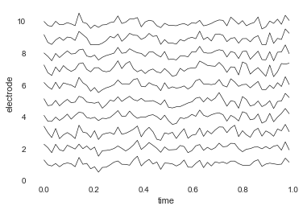
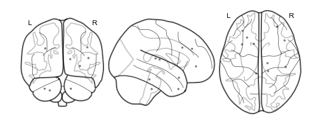
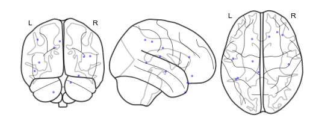
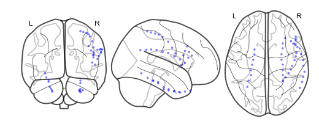
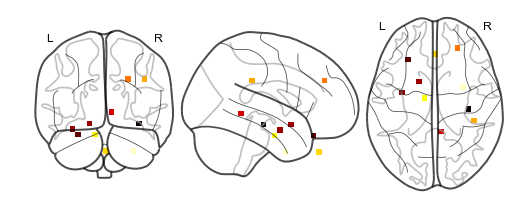

Building a brain object
=======================

Brain objects are supereeg’s fundamental data structure for a single
subject’s ECoG data. To create one at minimum you’ll need a matrix of
neural recordings (time samples by electrodes), electrode locations, and
a sample rate. Additionally, you can include information about separate
recording sessions and store custom meta data. In this tutorial, we’ll
build a brain object from scratch and get familiar with some of the
methods.

Load in the required libraries
==============================

.. code:: ipython2

    import supereeg as se
    import numpy as np
    import warnings 
    warnings.simplefilter("ignore")
    %matplotlib inline

Simulate some data
==================

First, we’ll use supereeg’s built in simulation functions to simulate
some data and electrodes. By default, the ``simulate_data`` function
will return a 1000 samples by 10 electrodes matrix, but you can specify
the number of time samples with ``n_samples`` and the number of
electrodes with ``n_elecs``. If you want further information on
simulating data, check out the simulate tutorial!

.. code:: ipython2

    # simulate some data
    bo_data = se.simulate_bo(n_samples=1000, sessions=2, n_elecs=10)
    
    # plot it
    bo_data.plot_data()
    
    # get just data
    data = bo_data.get_data()

.. image:: brain_objects_files/brain_objects_4_0.png

We’ll also simulate some electrode locations

.. code:: ipython2

    locs = se.simulate_locations()
    print(locs)

.. parsed-literal::

        x   y   z
    0 -31   1 -18
    1 -26  34 -24
    2 -11   9 -12
    3  -9  -8 -28
    4   6  38 -41
    5  10 -42  -3
    6  29  47  36
    7  32   3 -42
    8  41 -18 -16
    9  47 -34  32

Creating a brain object
=======================

To construct a new brain objects, simply pass the data and locations to
the ``Brain`` class like this:

.. code:: ipython2

    bo = se.Brain(data=data, locs=locs, sample_rate=100)

To view a summary of the contents of the brain object, you can call the
``info`` function:

.. code:: ipython2

    bo.info()

.. parsed-literal::

    Number of electrodes: 10
    Recording time in seconds: [10.]
    Sample Rate in Hz: [100]
    Number of sessions: 1
    Date created: Fri Jul 27 16:19:15 2018
    Meta data: {}

Optionally, you can pass a ``sessions`` parameter, which is can be a
numpy array or list the length of your data with a unique identifier for
each session. For example:

.. code:: ipython2

    sessions = np.array([1]*(data.shape[0]/2)+[2]*(data.shape[0]/2))
    bo = se.Brain(data=data, locs=locs, sample_rate=1000, sessions=sessions)
    bo.info()

.. parsed-literal::

    Number of electrodes: 10
    Recording time in seconds: [0.5 0.5]
    Sample Rate in Hz: [1000, 1000]
    Number of sessions: 2
    Date created: Fri Jul 27 16:19:15 2018
    Meta data: {}

You can also add custom meta data to the brain object to help keep track
of its contents. ``meta`` is a dictionary comprised of whatever you
want:

.. code:: ipython2

    meta = {
        'subjectID' : '123',
        'Investigator' : 'Andy',
        'Hospital' : 'DHMC'
    }
    bo = se.Brain(data=data, locs=locs, sample_rate=1000, sessions=sessions, meta=meta)
    bo.info()

.. parsed-literal::

    Number of electrodes: 10
    Recording time in seconds: [0.5 0.5]
    Sample Rate in Hz: [1000, 1000]
    Number of sessions: 2
    Date created: Fri Jul 27 16:19:15 2018
    Meta data: {'Hospital': 'DHMC', 'subjectID': '123', 'Investigator': 'Andy'}

Initialize brain objects
========================

``Brain`` objects can be initialized by passing a any of the following
to the ``Brain`` class instance initialization function: - A path to a
saved ``Brain`` object (ending in ``.bo``) - An existing ``Brain``
object (this creates a copy of the object) - A path to or instance of
any other supported toolbox type (``Model`` objects or .mo files, or
``Nifti`` objects or .nii files)

In addition, ``Brain`` objects may be created via ``load`` by specifying
``return_type='bo'``.

For example:

.. code:: ipython2

    nii_bo = se.Brain('example_nifti')

Or:

.. code:: ipython2

    nii_bo = se.load('example_nifti', return_type='bo')

Another feature, which can be particularly useful when working with
large files, is loading only a subfield by specifiying ``field``. For
example, if you only want to load locations:

.. code:: ipython2

    bo_locs = se.load('example_data', field='locs') 

The structure of a brain object
===============================

Inside the brain object, the ECoG data are stored in a Pandas DataFrame
that can be accessed with the ``get_data`` function:

.. code:: ipython2

    bo.get_data().head()

.. raw:: html

    

    
    <table border="1" class="dataframe">
      <thead>
        <tr style="text-align: right;">
          <th></th>
          <th>0</th>
          <th>1</th>
          <th>2</th>
          <th>3</th>
          <th>4</th>
          <th>5</th>
          <th>6</th>
          <th>7</th>
          <th>8</th>
          <th>9</th>
        </tr>
      </thead>
      <tbody>
        <tr>
          <th>0</th>
          <td>0.209741</td>
          <td>-0.512392</td>
          <td>-0.720984</td>
          <td>-0.754342</td>
          <td>-1.726174</td>
          <td>-0.443516</td>
          <td>-1.782753</td>
          <td>-0.713155</td>
          <td>-0.284680</td>
          <td>-0.068902</td>
        </tr>
        <tr>
          <th>1</th>
          <td>-1.055684</td>
          <td>-0.810194</td>
          <td>-0.673013</td>
          <td>0.483223</td>
          <td>0.008181</td>
          <td>-0.190715</td>
          <td>2.239795</td>
          <td>-0.028814</td>
          <td>-0.301845</td>
          <td>-1.022902</td>
        </tr>
        <tr>
          <th>2</th>
          <td>-0.346641</td>
          <td>-0.239482</td>
          <td>-0.370357</td>
          <td>0.246060</td>
          <td>-0.578913</td>
          <td>-0.565974</td>
          <td>-0.946681</td>
          <td>-0.358038</td>
          <td>-0.616623</td>
          <td>-0.124095</td>
        </tr>
        <tr>
          <th>3</th>
          <td>-0.610393</td>
          <td>0.130029</td>
          <td>-0.152837</td>
          <td>-1.142612</td>
          <td>-1.017601</td>
          <td>-0.409920</td>
          <td>-1.533653</td>
          <td>-0.806856</td>
          <td>-0.701596</td>
          <td>-0.249572</td>
        </tr>
        <tr>
          <th>4</th>
          <td>0.290803</td>
          <td>0.699244</td>
          <td>0.240235</td>
          <td>1.122073</td>
          <td>0.716814</td>
          <td>0.532778</td>
          <td>0.992918</td>
          <td>1.079572</td>
          <td>0.397130</td>
          <td>-0.019875</td>
        </tr>
      </tbody>
    </table>
    

Similarly, the electrode locations are stored as a Pandas DataFrame, and
can be retrieved using the ``get_locs`` method:

.. code:: ipython2

    bo.get_locs().head()

.. raw:: html

    

    
    <table border="1" class="dataframe">
      <thead>
        <tr style="text-align: right;">
          <th></th>
          <th>x</th>
          <th>y</th>
          <th>z</th>
        </tr>
      </thead>
      <tbody>
        <tr>
          <th>0</th>
          <td>-31</td>
          <td>1</td>
          <td>-18</td>
        </tr>
        <tr>
          <th>1</th>
          <td>-26</td>
          <td>34</td>
          <td>-24</td>
        </tr>
        <tr>
          <th>2</th>
          <td>-11</td>
          <td>9</td>
          <td>-12</td>
        </tr>
        <tr>
          <th>3</th>
          <td>-9</td>
          <td>-8</td>
          <td>-28</td>
        </tr>
        <tr>
          <th>4</th>
          <td>6</td>
          <td>38</td>
          <td>-41</td>
        </tr>
      </tbody>
    </table>
    

Brain objects are iterable, so you index a brain object like this:

.. code:: ipython2

    #return first time sample
    bo[0]
    #return first 3 time samples
    bo[:3] 
    #return first electrode
    bo[:, 0] 
    #returns first 3 timesamples/elecs
    bo_i = bo[:3, :3] 
    bo_i.get_data()

.. raw:: html

    

    
    <table border="1" class="dataframe">
      <thead>
        <tr style="text-align: right;">
          <th></th>
          <th>0</th>
          <th>1</th>
          <th>2</th>
        </tr>
      </thead>
      <tbody>
        <tr>
          <th>0</th>
          <td>0.209741</td>
          <td>-0.512392</td>
          <td>-0.720984</td>
        </tr>
        <tr>
          <th>1</th>
          <td>-1.055684</td>
          <td>-0.810194</td>
          <td>-0.673013</td>
        </tr>
        <tr>
          <th>2</th>
          <td>-0.346641</td>
          <td>-0.239482</td>
          <td>-0.370357</td>
        </tr>
      </tbody>
    </table>
    

You can also pass a list of indices for either ``times`` (sample
numbers) or ``locs`` to the ``get_slice`` method and return a subset of
the brain object.

.. code:: ipython2

    bo_s = bo.get_slice(sample_inds=[0,1,2], loc_inds=[0,1,2])
    bo_s.get_data()

.. raw:: html

    

    
    <table border="1" class="dataframe">
      <thead>
        <tr style="text-align: right;">
          <th></th>
          <th>0</th>
          <th>1</th>
          <th>2</th>
        </tr>
      </thead>
      <tbody>
        <tr>
          <th>0</th>
          <td>0.209741</td>
          <td>-0.512392</td>
          <td>-0.720984</td>
        </tr>
        <tr>
          <th>1</th>
          <td>-1.055684</td>
          <td>-0.810194</td>
          <td>-0.673013</td>
        </tr>
        <tr>
          <th>2</th>
          <td>-0.346641</td>
          <td>-0.239482</td>
          <td>-0.370357</td>
        </tr>
      </tbody>
    </table>
    

You can resample your data by specifying a new sample rate

.. code:: ipython2

    bo.resample(64)
    bo.info()

.. parsed-literal::

    Number of electrodes: 10
    Recording time in seconds: [0.5 0.5]
    Sample Rate in Hz: [64, 64]
    Number of sessions: 2
    Date created: Fri Jul 27 16:19:15 2018
    Meta data: {'Hospital': 'DHMC', 'subjectID': '123', 'Investigator': 'Andy'}

You can also plot both the data and the electrode locations:

.. code:: ipython2

    bo.plot_data()

.. code:: ipython2

    bo.plot_locs()

The other pieces of the brain object are listed below:

.. code:: ipython2

    # array of session identifiers for each timepoint
    sessions = bo.sessions
    
    # number of sessions
    n_sessions = bo.n_sessions
    
    # sample rate
    sample_rate = bo.sample_rate
    
    # number of electrodes
    n_elecs = bo.n_elecs
    
    # length of each recording session in seconds
    n_seconds = bo.dur
    
    # the date and time that the bo was created
    date_created = bo.date_created
    
    # kurtosis of each electrode
    kurtosis = bo.kurtosis
    
    # meta data
    meta = bo.meta
    
    # label delinieating observed and reconstructed locations
    label = bo.label

Brain object methods
====================

There are a few other useful methods on a brain object

``bo.info()``
-------------

This method will give you a summary of the brain object:

.. code:: ipython2

    bo.info()

.. parsed-literal::

    Number of electrodes: 10
    Recording time in seconds: [0.5 0.5]
    Sample Rate in Hz: [64, 64]
    Number of sessions: 2
    Date created: Fri Jul 27 16:19:15 2018
    Meta data: {'Hospital': 'DHMC', 'subjectID': '123', 'Investigator': 'Andy'}

``bo.apply_filter()``
---------------------

This method will return a filtered copy of the brain object.

.. code:: ipython2

    bo_f = bo.apply_filter()

``bo.get_data()``
-----------------

.. code:: ipython2

    data_array = bo.get_data()

``bo.get_zscore_data()``
------------------------

This method will return a numpy array of the zscored data:

.. code:: ipython2

    zdata_array = bo.get_zscore_data()

``bo.get_locs()``
-----------------

This method will return a numpy array of the electrode locations:

.. code:: ipython2

    locs = bo.get_locs()

``bo.get_slice()``
------------------

This method allows you to slice out time and locations from the brain
object, and returns a brain object. This can occur in place if you set
the flag ``inplace=True``.

.. code:: ipython2

    bo_slice = bo.get_slice(sample_inds=None, loc_inds=None, inplace=False)

``bo.resample()``
-----------------

This method allows you resample a brain object in place.

.. code:: ipython2

    bo.resample(resample_rate=None)

.. parsed-literal::

    <supereeg.brain.Brain at 0x116c298d0>

``bo.plot_data()``
------------------

This method normalizes and plots data from brain object:

.. code:: ipython2

    bo.plot_data()

``bo.plot_locs()``
------------------

This method plots electrode locations from brain object:

.. code:: ipython2

    bo_f = se.load('example_filter')

.. code:: ipython2

    bo_f.plot_locs()

``bo.to_nii()``
---------------

This method converts the brain object into supereeg’s ``nifti`` class (a
subclass of the ``nibabel`` nifti class). If ``filepath`` is specified,
the nifti file will be saved. You can also specify a nifti template with
the ``template`` argument. If no template is specified, it will use the
gray matter masked MNI 152 brain downsampled to 6mm.

.. code:: ipython2

    # convert to nifti
    nii = bo.to_nii(template='gray', vox_size=6)
    
    # plot first timepoint
    nii.plot_glass_brain()
    
    # save the file
    # nii = bo.to_nii(filepath='/path/to/file/brain')
    
    # specify a template and resolution
    # nii = bo.to_nii(template='/path/to/nifti/file.nii', vox_size=20)

``bo.save(fname='something')``
------------------------------

This method will save the brain object to the specified file location.
The data will be saved as a ‘bo’ file, which is a dictionary containing
the elements of a brain object saved in the hd5 format using
``deepdish``.

.. code:: ipython2

    #bo.save(fname='brain_object')
