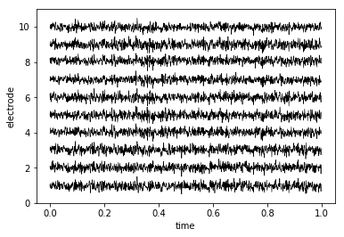

Building a brain object
=======================

Brain objects are supereeg’s fundamental data structure for a single
subject’s iEEG data. To create one at minimum you’ll need a matrix of
neural recordings (time samples by electrodes), electrode locations, and
a sample rate. Additionally, you can include information about separate
recording sessions and store custom meta data. In this tutorial, we’ll
build a brain object from scratch and get familiar with some of the
methods.

Load in the required libraries
==============================

.. code:: ipython2

    import warnings 
    warnings.simplefilter("ignore")
    import supereeg as se
    import numpy as np
    import seaborn as sns
    import matplotlib.pyplot as plt

Simulate some data
==================

First, we’ll use supereeg’s built in simulation functions to simulate
some data and electrodes. By default, the ``simulate_data`` function
will return a 1000 samples by 10 electrodes matrix, but you can specify
the number of time samples with ``n_samples`` and the number of
electrodes with ``n_elecs``. If you want further information on
simulating data, check out the simulate tutorial!

.. code:: ipython2

    # simulate some data
    data = se.simulate_bo(n_samples=1000, sessions=2, n_elecs=10).get_data()
    
    # plot it
    plt.plot(data)
    plt.xlabel('time samples')
    plt.ylabel('activation')
    plt.show()

.. image:: brain_objects_files/brain_objects_4_0.png

We’ll also simulate some electrode locations

.. code:: ipython2

    locs = se.simulate_locations()
    print(locs)

.. parsed-literal::

        x   y   z
    0  24  45 -33
    1 -25 -16  29
    2 -48  20  16
    3  48  11 -33
    4 -48 -50 -48
    5  37 -16  22
    6  14  43  17
    7 -15  10  13
    8 -37  -7  36
    9 -31 -18  -2

Creating a brain object
=======================

To construct a new brain objects, simply pass the data and locations to
the ``Brain`` class like this:

.. code:: ipython2

    bo = se.Brain(data=data, locs=locs, sample_rate=100)

To view a summary of the contents of the brain object, you can call the
``info`` function:

.. code:: ipython2

    bo.info()

.. parsed-literal::

    Number of electrodes: 10
    Recording time in seconds: [ 10.]
    Number of sessions: 1
    Date created: Thu Feb  8 16:43:45 2018
    Meta data: {}

Optionally, you can pass a ``sessions`` parameter, which is can be a
numpy array or list the length of your data with a unique identifier for
each session. For example:

.. code:: ipython2

    sessions = np.array([1]*(data.shape[0]/2)+[2]*(data.shape[0]/2))
    bo = se.Brain(data=data, locs=locs, sample_rate=1000, sessions=sessions)
    bo.info()

.. parsed-literal::

    Number of electrodes: 10
    Recording time in seconds: [ 0.5  0.5]
    Number of sessions: 2
    Date created: Thu Feb  8 16:43:45 2018
    Meta data: {}

You can also pass add custom meta data to the brain object to help keep
track of its contents. ``meta`` is a dictionary comprised of whatever
you want:

.. code:: ipython2

    meta = {
        'subjectID' : '123',
        'Investigator' : 'Andy',
        'Hospital' : 'DHMC'
    }
    bo = se.Brain(data=data, locs=locs, sample_rate=1000, sessions=sessions, meta=meta)
    bo.info()

.. parsed-literal::

    Number of electrodes: 10
    Recording time in seconds: [ 0.5  0.5]
    Number of sessions: 2
    Date created: Thu Feb  8 16:43:45 2018
    Meta data: {'Hospital': 'DHMC', 'subjectID': '123', 'Investigator': 'Andy'}

The structure of a brain object
===============================

Inside the brain object, the iEEG data is stored as a Pandas DataFrame
that can be accessed directly:

.. code:: ipython2

    bo.data.head()

.. raw:: html

    

    
    <table border="1" class="dataframe">
      <thead>
        <tr style="text-align: right;">
          <th></th>
          <th>0</th>
          <th>1</th>
          <th>2</th>
          <th>3</th>
          <th>4</th>
          <th>5</th>
          <th>6</th>
          <th>7</th>
          <th>8</th>
          <th>9</th>
        </tr>
      </thead>
      <tbody>
        <tr>
          <th>0</th>
          <td>0.382586</td>
          <td>0.333622</td>
          <td>0.214103</td>
          <td>-0.265925</td>
          <td>0.325929</td>
          <td>0.805790</td>
          <td>-0.021989</td>
          <td>0.646090</td>
          <td>0.058325</td>
          <td>-0.076683</td>
        </tr>
        <tr>
          <th>1</th>
          <td>-0.463498</td>
          <td>-0.150590</td>
          <td>-0.205202</td>
          <td>-0.407724</td>
          <td>-0.431042</td>
          <td>-0.508995</td>
          <td>-0.536993</td>
          <td>-0.557777</td>
          <td>-0.339154</td>
          <td>-0.338929</td>
        </tr>
        <tr>
          <th>2</th>
          <td>0.196829</td>
          <td>-0.469763</td>
          <td>0.683407</td>
          <td>1.378482</td>
          <td>0.811645</td>
          <td>0.118007</td>
          <td>1.327783</td>
          <td>0.781677</td>
          <td>0.180177</td>
          <td>0.644221</td>
        </tr>
        <tr>
          <th>3</th>
          <td>0.731063</td>
          <td>0.414445</td>
          <td>0.541975</td>
          <td>0.562243</td>
          <td>1.128243</td>
          <td>0.979952</td>
          <td>0.731497</td>
          <td>0.793575</td>
          <td>0.813715</td>
          <td>0.495433</td>
        </tr>
        <tr>
          <th>4</th>
          <td>-0.650483</td>
          <td>-0.647418</td>
          <td>-0.255525</td>
          <td>-0.352095</td>
          <td>-0.737620</td>
          <td>-0.990270</td>
          <td>-0.181314</td>
          <td>-0.790536</td>
          <td>-0.555052</td>
          <td>-0.595288</td>
        </tr>
      </tbody>
    </table>
    

or returned as a numpy array using the ``get_data`` method:

.. code:: ipython2

    bo.get_data()

.. parsed-literal::

    array([[ 0.38258564,  0.33362172,  0.21410298, ...,  0.64608996,
             0.05832478, -0.07668315],
           [-0.46349806, -0.15059048, -0.20520242, ..., -0.55777727,
            -0.33915407, -0.33892933],
           [ 0.19682918, -0.46976349,  0.6834066 , ...,  0.78167735,
             0.18017724,  0.64422098],
           ..., 
           [-0.22162661,  0.53725265,  0.02315143, ..., -0.26951488,
            -0.40746491,  0.40569943],
           [-1.33850292, -1.80492147, -1.19813078, ..., -0.70659012,
            -0.72775529, -0.56779603],
           [ 0.45456363,  0.71542546,  0.30851046, ...,  0.73372424,
            -0.23424389,  0.12040398]])

Similarly, the electrode locations are stored as a Pandas DataFrame, and
can be retrieved as a numpy array using the ``get_locs`` method:

.. code:: ipython2

    bo.locs.head()

.. raw:: html

    

    
    <table border="1" class="dataframe">
      <thead>
        <tr style="text-align: right;">
          <th></th>
          <th>x</th>
          <th>y</th>
          <th>z</th>
        </tr>
      </thead>
      <tbody>
        <tr>
          <th>0</th>
          <td>24</td>
          <td>45</td>
          <td>-33</td>
        </tr>
        <tr>
          <th>1</th>
          <td>-25</td>
          <td>-16</td>
          <td>29</td>
        </tr>
        <tr>
          <th>2</th>
          <td>-48</td>
          <td>20</td>
          <td>16</td>
        </tr>
        <tr>
          <th>3</th>
          <td>48</td>
          <td>11</td>
          <td>-33</td>
        </tr>
        <tr>
          <th>4</th>
          <td>-48</td>
          <td>-50</td>
          <td>-48</td>
        </tr>
      </tbody>
    </table>
    

.. code:: ipython2

    bo.get_locs()

.. parsed-literal::

    array([[ 24,  45, -33],
           [-25, -16,  29],
           [-48,  20,  16],
           [ 48,  11, -33],
           [-48, -50, -48],
           [ 37, -16,  22],
           [ 14,  43,  17],
           [-15,  10,  13],
           [-37,  -7,  36],
           [-31, -18,  -2]])

You can also pass a list of indices for either ``times`` or ``locs`` and
return a subset of the brain object

.. code:: ipython2

    bo_s = bo.get_slice(times=[1,2,3], locs=[1,2,3])
    bo_s.get_data()

.. parsed-literal::

    array([[-0.15059048, -0.20520242, -0.4077237 ],
           [-0.46976349,  0.6834066 ,  1.37848224],
           [ 0.41444456,  0.54197526,  0.56224315]])

You can also plot both the data and the electrode locations:

.. code:: ipython2

    bo.plot_data()
    plt.show()

.. code:: ipython2

    bo.plot_locs()

The other pieces of the brain object are listed below:

.. code:: ipython2

    # array of session identifiers for each timepoint
    sessions = bo.sessions
    
    # number of sessions
    n_sessions = bo.n_sessions
    
    # sample rate
    sample_rate = bo.sample_rate
    
    # number of electrodes
    n_elecs = bo.n_elecs
    
    # length of each recording session in seconds
    n_seconds = bo.n_secs
    
    # the date and time that the bo was created
    date_created = bo.date_created
    
    # kurtosis of each electrode
    kurtosis = bo.kurtosis
    
    # meta data
    meta = bo.meta
    
    # label delinieating observed and reconstructed locations
    label = bo.label

Brain object methods
====================

There are a few other useful methods on a brain object

``bo.info()``
-------------

This method will give you a summary of the brain object:

.. code:: ipython2

    bo.info()

.. parsed-literal::

    Number of electrodes: 10
    Recording time in seconds: [ 0.5  0.5]
    Number of sessions: 2
    Date created: Thu Feb  8 16:43:45 2018
    Meta data: {'Hospital': 'DHMC', 'subjectID': '123', 'Investigator': 'Andy'}

``bo.get_data()``
-----------------

.. code:: ipython2

    data_array = bo.get_data()

``bo.get_zscore_data()``
------------------------

This method will return a numpy array of the zscored data:

.. code:: ipython2

    zdata_array = bo.get_zscore_data()

``bo.get_locs()``
-----------------

This method will return a numpy array of the electrode locations:

.. code:: ipython2

    locs = bo.get_locs()

``bo.get_slice()``
------------------

This method allows you to slice out time and locations from the brain
object, and returns a brain object.

.. code:: ipython2

    bo_slice = bo.get_slice(times=None, locs=None)

``bo.plot_data()``
------------------

This method normalizes and plots data from brain object:

.. code:: ipython2

    bo.plot_data()

.. image:: brain_objects_files/brain_objects_41_0.png

``bo.plot_locs()``
------------------

This method plots electrode locations from brain object:

.. code:: ipython2

    bo.plot_locs()

.. image:: brain_objects_files/brain_objects_43_0.png

``bo.save(fname='something')``
------------------------------

This method will save the brain object to the specified file location.
The data will be saved as a ‘bo’ file, which is a dictionary containing
the elements of a brain object saved in the hd5 format using
``deepdish``.

.. code:: ipython2

    #bo.save(fname='brain_object')

``bo.to_nii()``
---------------

This method converts the brain object into a ``nibabel`` nifti image. If
``filepath`` is specified, the nifti file will be saved. You can also
specify a nifti template with the ``template`` argument.

.. code:: ipython2

    # convert to nifit
    # nii = bo.to_nii()
    
    # save the file
    # nii = bo.to_nii(filepath='/path/to/file/brain')
    
    # specify a template
    # nii = bo.to_nii(template='/path/to/nifti/file.nii')
