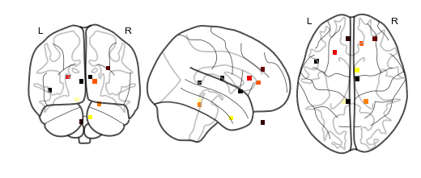

Building a brain object
=======================

Brain objects are supereeg’s fundamental data structure for a single
subject’s iEEG data. To create one at minimum you’ll need a matrix of
neural recordings (time samples by electrodes), electrode locations, and
a sample rate. Additionally, you can include information about separate
recording sessions and store custom meta data. In this tutorial, we’ll
build a brain object from scratch and get familiar with some of the
methods.

Load in the required libraries
==============================

.. code:: ipython2

    import warnings 
    warnings.simplefilter("ignore")
    %matplotlib inline
    import supereeg as se
    import numpy as np

Simulate some data
==================

First, we’ll use supereeg’s built in simulation functions to simulate
some data and electrodes. By default, the ``simulate_data`` function
will return a 1000 samples by 10 electrodes matrix, but you can specify
the number of time samples with ``n_samples`` and the number of
electrodes with ``n_elecs``. If you want further information on
simulating data, check out the simulate tutorial!

.. code:: ipython2

    # simulate some data
    bo_data = se.simulate_bo(n_samples=1000, sessions=2, n_elecs=10)
    
    # plot it
    bo_data.plot_data()
    
    # get just data
    data = bo_data.get_data()

.. image:: brain_objects_files/brain_objects_4_0.png

We’ll also simulate some electrode locations

.. code:: ipython2

    locs = se.simulate_locations()
    print(locs)

.. parsed-literal::

        x   y   z
    0 -44 -41   5
    1 -38   8  49
    2 -25  25 -27
    3 -17  42   3
    4  -9  -7  -9
    5  -8 -41  40
    6  11   8 -39
    7  14  49  -3
    8  33  14  25
    9  46 -34  -2

Creating a brain object
=======================

To construct a new brain objects, simply pass the data and locations to
the ``Brain`` class like this:

.. code:: ipython2

    bo = se.Brain(data=data, locs=locs, sample_rate=100)

To view a summary of the contents of the brain object, you can call the
``info`` function:

.. code:: ipython2

    bo.info()

.. parsed-literal::

    Number of electrodes: 10
    Recording time in seconds: [10.]
    Sample Rate in Hz: [100]
    Number of sessions: 1
    Date created: Thu Mar  8 12:51:41 2018
    Meta data: {}

Optionally, you can pass a ``sessions`` parameter, which is can be a
numpy array or list the length of your data with a unique identifier for
each session. For example:

.. code:: ipython2

    sessions = np.array([1]*(data.shape[0]/2)+[2]*(data.shape[0]/2))
    bo = se.Brain(data=data, locs=locs, sample_rate=1000, sessions=sessions)
    bo.info()

.. parsed-literal::

    Number of electrodes: 10
    Recording time in seconds: [0.5 0.5]
    Sample Rate in Hz: [1000, 1000]
    Number of sessions: 2
    Date created: Thu Mar  8 12:51:41 2018
    Meta data: {}

You can also pass add custom meta data to the brain object to help keep
track of its contents. ``meta`` is a dictionary comprised of whatever
you want:

.. code:: ipython2

    meta = {
        'subjectID' : '123',
        'Investigator' : 'Andy',
        'Hospital' : 'DHMC'
    }
    bo = se.Brain(data=data, locs=locs, sample_rate=1000, sessions=sessions, meta=meta)
    bo.info()

.. parsed-literal::

    Number of electrodes: 10
    Recording time in seconds: [0.5 0.5]
    Sample Rate in Hz: [1000, 1000]
    Number of sessions: 2
    Date created: Thu Mar  8 12:51:41 2018
    Meta data: {'Hospital': 'DHMC', 'subjectID': '123', 'Investigator': 'Andy'}

Initialize brain objects
========================

Brain objects can be initialized by passing a brain object (ending in
``.bo``), but can also be initialized with a model object or nifti
object by specifying ``return_type`` as ``bo`` in the load function.

For example, you can load a nifti object as a brain object:

.. code:: ipython2

    se.load('example_nifti', return_type='bo')

.. parsed-literal::

    <supereeg.brain.Brain at 0x112470290>

The structure of a brain object
===============================

Inside the brain object, the iEEG data is stored as a Pandas DataFrame
that can be accessed directly:

.. code:: ipython2

    bo.data.head()

.. raw:: html

    

    
    <table border="1" class="dataframe">
      <thead>
        <tr style="text-align: right;">
          <th></th>
          <th>0</th>
          <th>1</th>
          <th>2</th>
          <th>3</th>
          <th>4</th>
          <th>5</th>
          <th>6</th>
          <th>7</th>
          <th>8</th>
          <th>9</th>
        </tr>
      </thead>
      <tbody>
        <tr>
          <th>0</th>
          <td>0.308856</td>
          <td>-0.506142</td>
          <td>-0.335892</td>
          <td>0.932700</td>
          <td>-0.018159</td>
          <td>0.677721</td>
          <td>0.621685</td>
          <td>1.161105</td>
          <td>0.341360</td>
          <td>0.039930</td>
        </tr>
        <tr>
          <th>1</th>
          <td>-0.844416</td>
          <td>-1.883306</td>
          <td>-0.853730</td>
          <td>-0.936994</td>
          <td>-0.597700</td>
          <td>-0.581850</td>
          <td>-0.209145</td>
          <td>-0.578121</td>
          <td>-0.670196</td>
          <td>-0.859038</td>
        </tr>
        <tr>
          <th>2</th>
          <td>0.009260</td>
          <td>-0.523275</td>
          <td>-0.093883</td>
          <td>-0.427795</td>
          <td>-0.621431</td>
          <td>-0.077425</td>
          <td>0.167277</td>
          <td>-0.360310</td>
          <td>-0.578461</td>
          <td>0.335206</td>
        </tr>
        <tr>
          <th>3</th>
          <td>-0.235899</td>
          <td>-0.189871</td>
          <td>0.035056</td>
          <td>0.571969</td>
          <td>0.246424</td>
          <td>0.139688</td>
          <td>0.092732</td>
          <td>0.623063</td>
          <td>-0.239218</td>
          <td>0.418275</td>
        </tr>
        <tr>
          <th>4</th>
          <td>-1.073915</td>
          <td>-0.700239</td>
          <td>-1.347498</td>
          <td>-1.305489</td>
          <td>-0.852599</td>
          <td>-0.977627</td>
          <td>-0.799296</td>
          <td>-1.558325</td>
          <td>-1.591019</td>
          <td>-1.221074</td>
        </tr>
      </tbody>
    </table>
    

or returned as a numpy array using the ``get_data`` method:

.. code:: ipython2

    bo.get_data()

.. parsed-literal::

    array([[ 0.30885567, -0.50614166, -0.3358917 , ...,  1.16110505,
             0.34135963,  0.03992981],
           [-0.84441565, -1.88330591, -0.8537304 , ..., -0.57812073,
            -0.67019566, -0.85903781],
           [ 0.00926044, -0.5232751 , -0.09388341, ..., -0.36031039,
            -0.57846081,  0.33520564],
           ...,
           [-0.25120677, -0.06627608, -0.01759761, ...,  1.52473411,
             0.96244716,  0.05365348],
           [-0.25912916, -0.11148713, -0.56294205, ..., -1.31569476,
            -1.37269281, -0.1475099 ],
           [ 0.41473627,  0.39586839,  0.95558275, ...,  1.75949778,
             2.21979509,  1.14837146]])

Similarly, the electrode locations are stored as a Pandas DataFrame, and
can be retrieved as a numpy array using the ``get_locs`` method:

.. code:: ipython2

    bo.locs.head()

.. raw:: html

    

    
    <table border="1" class="dataframe">
      <thead>
        <tr style="text-align: right;">
          <th></th>
          <th>x</th>
          <th>y</th>
          <th>z</th>
        </tr>
      </thead>
      <tbody>
        <tr>
          <th>0</th>
          <td>-44</td>
          <td>-41</td>
          <td>5</td>
        </tr>
        <tr>
          <th>1</th>
          <td>-38</td>
          <td>8</td>
          <td>49</td>
        </tr>
        <tr>
          <th>2</th>
          <td>-25</td>
          <td>25</td>
          <td>-27</td>
        </tr>
        <tr>
          <th>3</th>
          <td>-17</td>
          <td>42</td>
          <td>3</td>
        </tr>
        <tr>
          <th>4</th>
          <td>-9</td>
          <td>-7</td>
          <td>-9</td>
        </tr>
      </tbody>
    </table>
    

.. code:: ipython2

    bo.get_locs()

.. parsed-literal::

    array([[-44, -41,   5],
           [-38,   8,  49],
           [-25,  25, -27],
           [-17,  42,   3],
           [ -9,  -7,  -9],
           [ -8, -41,  40],
           [ 11,   8, -39],
           [ 14,  49,  -3],
           [ 33,  14,  25],
           [ 46, -34,  -2]])

You can also pass a list of indices for either ``times`` or ``locs`` and
return a subset of the brain object

.. code:: ipython2

    bo_s = bo.get_slice(sample_inds=[1,2,3], loc_inds=[1,2,3])
    bo_s.get_data()

.. parsed-literal::

    array([[-1.88330591, -0.8537304 , -0.9369943 ],
           [-0.5232751 , -0.09388341, -0.42779472],
           [-0.18987077,  0.0350558 ,  0.57196911]])

You can resample your data by specifying a new resample rate

.. code:: ipython2

    bo.resample(64)

You can also plot both the data and the electrode locations:

.. code:: ipython2

    bo.plot_data()

.. image:: brain_objects_files/brain_objects_29_0.png

.. code:: ipython2

    bo.plot_locs()

.. image:: brain_objects_files/brain_objects_30_0.png

The other pieces of the brain object are listed below:

.. code:: ipython2

    # array of session identifiers for each timepoint
    sessions = bo.sessions
    
    # number of sessions
    n_sessions = bo.n_sessions
    
    # sample rate
    sample_rate = bo.sample_rate
    
    # number of electrodes
    n_elecs = bo.n_elecs
    
    # length of each recording session in seconds
    n_seconds = bo.n_secs
    
    # the date and time that the bo was created
    date_created = bo.date_created
    
    # kurtosis of each electrode
    kurtosis = bo.kurtosis
    
    # meta data
    meta = bo.meta
    
    # label delinieating observed and reconstructed locations
    label = bo.label

Brain object methods
====================

There are a few other useful methods on a brain object

``bo.info()``
-------------

This method will give you a summary of the brain object:

.. code:: ipython2

    bo.info()

.. parsed-literal::

    Number of electrodes: 10
    Recording time in seconds: [0.5 0.5]
    Sample Rate in Hz: [64, 64]
    Number of sessions: 2
    Date created: Thu Mar  8 12:51:41 2018
    Meta data: {'Hospital': 'DHMC', 'subjectID': '123', 'Investigator': 'Andy'}

``bo.get_data()``
-----------------

.. code:: ipython2

    data_array = bo.get_data()

``bo.get_zscore_data()``
------------------------

This method will return a numpy array of the zscored data:

.. code:: ipython2

    zdata_array = bo.get_zscore_data()

``bo.get_locs()``
-----------------

This method will return a numpy array of the electrode locations:

.. code:: ipython2

    locs = bo.get_locs()

``bo.get_slice()``
------------------

This method allows you to slice out time and locations from the brain
object, and returns a brain object. This can occur in place if you set
the flag ``inplace=True``.

.. code:: ipython2

    bo_slice = bo.get_slice(sample_inds=None, loc_inds=None, inplace=False)

``bo.resample()``
-----------------

This method allows you resample a brain object in place.

.. code:: ipython2

    bo.resample(resample_rate=None)

.. parsed-literal::

    <supereeg.brain.Brain at 0x112575210>

``bo.plot_data()``
------------------

This method normalizes and plots data from brain object:

.. code:: ipython2

    bo.plot_data()

.. image:: brain_objects_files/brain_objects_47_0.png

``bo.plot_locs()``
------------------

This method plots electrode locations from brain object:

.. code:: ipython2

    bo.plot_locs()

.. image:: brain_objects_files/brain_objects_49_0.png

``bo.save(fname='something')``
------------------------------

This method will save the brain object to the specified file location.
The data will be saved as a ‘bo’ file, which is a dictionary containing
the elements of a brain object saved in the hd5 format using
``deepdish``.

.. code:: ipython2

    #bo.save(fname='brain_object')

``bo.to_nii()``
---------------

This method converts the brain object into a ``nibabel`` nifti image. If
``filepath`` is specified, the nifti file will be saved. You can also
specify a nifti template with the ``template`` argument. If no template
is specified, it will use the gray matter masked MNI 152 brain
downsampled to 6mm.

.. code:: ipython2

    # convert to nifti
    nii = bo.to_nii()
    
    # plot first timepoint
    nii.plot_glass_brain()
    
    # save the file
    # nii = bo.to_nii(filepath='/path/to/file/brain')
    
    # specify a template and resolution
    # nii = bo.to_nii(template='/path/to/nifti/file.nii', vox_size=20)

