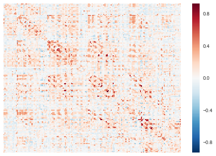
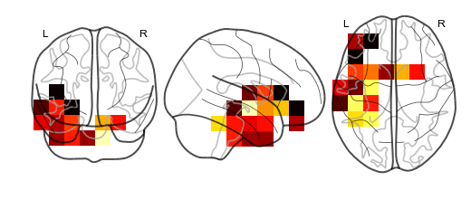
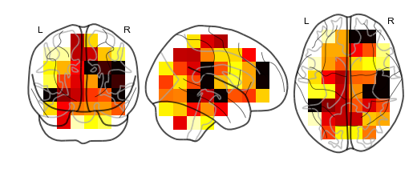

Model objects and predicting whole brain activity
=================================================

Model objects are superEEG's class that contains the model that
reconstructs full brain activity timeseries from a smaller sample of
electrodes. The superEEG package offers a few premade models that you
can use to reconstruct brain activity, but also a way to create your own
model if you have a dataset of intracranial patient data converted into
the brain object format. This tutorial will go over how to use the
premade models included in this package, as well as make a new model
from scratch.

Load in the required libraries
==============================

.. code:: ipython2

    import superEEG as se
    import seaborn as sns
    from nilearn import plotting
    from nilearn import image

First, let's load in one of the default models. Below is a model that we
made from the pyFR dataset sampled at 20mm resolution. The 'k10' means
that electrodes with a threshold exceeding 10 were removed from the
dataset, and 'r20' means that the model uses a radial basis function of
with a width of 20 mm to 'fill in' nearby electrode sites during the
model creation.

.. code:: ipython2

    model = se.load('pyFR_k10r20_20mm')
    model.info()

.. parsed-literal::

    Number of locations: 170
    Number of subjects: 67
    Date created: Wed Sep 13 20:44:31 2017
    Meta data: None

Visualizing the model
---------------------

The model is comprised of a number of fields. The most important are the
``model.numerator`` and ``model.denominator``. Dividing these two fields
gives a matrix of z-values, where the value in each cell represents the
covariance between every model brain location with every other model
brain location. To view the model, simply call the ``model.plot``
method. This method wraps ``seaborn.heatmap`` to plot the model
(transformed from z to r), so any arguments that ``seaborn.heatmap``
accepts are supported by ``model.plot``.

.. code:: ipython2

    model.plot(xticklabels=False, yticklabels=False)

.. parsed-literal::

    /Users/andyheusser/Documents/github/superEEG/superEEG/model.py:334: RuntimeWarning: invalid value encountered in divide
      sns.heatmap(z2r(np.divide(self.numerator, self.denominator)), **kwargs)

Updating the model
------------------

Now, let's say we wanted to update the model with a new subjects data.
To do this, we can use the ``update`` method, passing a new subjects
data as a brain object. First, let's load in an example subjects data:

.. code:: ipython2

    bo = se.load('example_data')
    bo.info()

.. parsed-literal::

    Number of electrodes: 64
    Recording time in seconds: [[19 19 19]]
    Number of sessions: 1
    Date created: Wed Sep 13 20:44:31 2017
    Meta data: CH003

and then update the model:

.. code:: ipython2

    updated_model = model.update(bo)
    updated_model.info()

.. parsed-literal::

    /Users/andyheusser/Documents/github/superEEG/superEEG/_helpers/stats.py:141: RuntimeWarning: divide by zero encountered in log
      return 0.5 * (np.log(1 + r) - np.log(1 - r))
    /Users/andyheusser/Documents/github/superEEG/superEEG/_helpers/stats.py:122: RuntimeWarning: invalid value encountered in true_divide
      return (np.exp(2 * z) - 1) / (np.exp(2 * z) + 1)

.. parsed-literal::

    Number of locations: 170
    Number of subjects: 68
    Date created: Wed Sep 13 20:44:32 2017
    Meta data: None

Note that the model is now comprised of 68 subjects, instead of 67
before we updated it.

Creating a new model
--------------------

In addition to including a few premade models in the ``superEEG``
package, we also provide a way to construct a model from scratch. For
example, if you have a dataset of iEEG patients, we provide a way to
construct a model that will predict whole brain activity. The more
subjects you include in the model, the better it will be! To create a
model, first you'll need to format your subject data into brain objects.
For the purpose of demonstration, we will simulate 10 subjects and
construct the model from that data:

.. code:: ipython2

    n_subs = 10
    bos = [se.simulate_bo(sample_rate=1000) for i in range(n_subs)]
    bos[0].info()

.. parsed-literal::

    Number of electrodes: 10
    Recording time in seconds: 1
    Number of sessions: 1
    Date created: Wed Sep 13 20:44:32 2017
    Meta data: None

As you can see above, each simulated subject has 10 (randomly placed)
'electrodes', with 1 second of data each. To construct a model from
these brain objects, simply pass them to the ``se.Model`` class, and a
new model will be generated:

.. code:: ipython2

    new_model = se.Model(bos)
    new_model.info()

.. parsed-literal::

    [[             nan  -6.87708413e-03  -5.59474133e-02  -3.38765012e-02
        1.63295034e-02  -6.67252750e-05  -1.20001620e-02  -3.27107844e-02
        3.70725919e-02   2.32087239e-02]
     [ -6.87708413e-03              nan   3.87179373e-02  -3.82723730e-02
        3.69870681e-03   7.21586713e-03   2.65146601e-03   3.10436377e-03
       -2.98198429e-02  -3.04856812e-03]
     [ -5.59474133e-02   3.87179373e-02              nan   3.93094861e-02
        1.26700369e-02   4.51246593e-03  -2.43475303e-02   2.68026475e-02
        9.37273308e-03  -8.76411236e-04]
     [ -3.38765012e-02  -3.82723730e-02   3.93094861e-02              nan
        1.93271709e-02   3.10411018e-02  -3.49305026e-03   3.21747820e-02
        1.83071697e-03   1.84306676e-02]
     [  1.63295034e-02   3.69870681e-03   1.26700369e-02   1.93271709e-02
                   nan  -6.66003659e-03   2.23470534e-02  -4.77845229e-02
       -2.93990110e-02  -5.15177191e-03]
     [ -6.67252750e-05   7.21586713e-03   4.51246593e-03   3.10411018e-02
       -6.66003659e-03              nan  -3.04125798e-02  -3.08451415e-02
        8.11346850e-03  -4.08488551e-02]
     [ -1.20001620e-02   2.65146601e-03  -2.43475303e-02  -3.49305026e-03
        2.23470534e-02  -3.04125798e-02              nan   2.28681938e-02
       -1.47843856e-02   1.57952340e-02]
     [ -3.27107844e-02   3.10436377e-03   2.68026475e-02   3.21747820e-02
       -4.77845229e-02  -3.08451415e-02   2.28681938e-02              nan
        3.89730493e-02   1.53346608e-02]
     [  3.70725919e-02  -2.98198429e-02   9.37273308e-03   1.83071697e-03
       -2.93990110e-02   8.11346850e-03  -1.47843856e-02   3.89730493e-02
                   nan   9.54392746e-02]
     [  2.32087239e-02  -3.04856812e-03  -8.76411236e-04   1.84306676e-02
       -5.15177191e-03  -4.08488551e-02   1.57952340e-02   1.53346608e-02
        9.54392746e-02              nan]]

.. parsed-literal::

    /Users/andyheusser/Library/Enthought/Canopy_64bit/User/lib/python2.7/site-packages/numpy/lib/function_base.py:4011: RuntimeWarning: Invalid value encountered in median
      r = func(a, **kwargs)
    /Users/andyheusser/Documents/github/superEEG/superEEG/brain.py:111: UserWarning: No sample rate given.  Setting sample rate to 1000
      warnings.warn('No sample rate given.  Setting sample rate to 1000')

.. parsed-literal::

    [[        nan -0.01491981 -0.02990247 -0.02898769  0.03314637  0.00239744
       0.00101126  0.01623338 -0.00176855 -0.00142397]
     [-0.01491981         nan  0.02543507  0.02320719  0.01783725  0.03563122
       0.01758327 -0.00557519 -0.00912906  0.00999349]
     [-0.02990247  0.02543507         nan -0.00402925 -0.06226255 -0.05137632
      -0.00709385  0.00013164 -0.04259269 -0.00522798]
     [-0.02898769  0.02320719 -0.00402925         nan  0.00120641  0.06225868
       0.0492035   0.03260706 -0.03277279 -0.01634918]
     [ 0.03314637  0.01783725 -0.06226255  0.00120641         nan  0.04768084
       0.03030508 -0.07187101 -0.01377234  0.01425546]
     [ 0.00239744  0.03563122 -0.05137632  0.06225868  0.04768084         nan
       0.01184021 -0.01393196 -0.02967923  0.02463967]
     [ 0.00101126  0.01758327 -0.00709385  0.0492035   0.03030508  0.01184021
              nan -0.03287814  0.01723475  0.06240547]
     [ 0.01623338 -0.00557519  0.00013164  0.03260706 -0.07187101 -0.01393196
      -0.03287814         nan -0.01728629 -0.01566387]
     [-0.00176855 -0.00912906 -0.04259269 -0.03277279 -0.01377234 -0.02967923
       0.01723475 -0.01728629         nan -0.00405797]
     [-0.00142397  0.00999349 -0.00522798 -0.01634918  0.01425546  0.02463967
       0.06240547 -0.01566387 -0.00405797         nan]]
    [[        nan  0.0174751  -0.01527889  0.00276749  0.02579992 -0.00442894
      -0.03570404 -0.00412434  0.00475213 -0.02499059]
     [ 0.0174751          nan -0.03475182 -0.03792078  0.00947733 -0.03440756
       0.03552093 -0.02436601 -0.02491756 -0.04273058]
     [-0.01527889 -0.03475182         nan  0.00565771  0.00021096 -0.03876059
      -0.03104815  0.02017341 -0.01957093 -0.03306179]
     [ 0.00276749 -0.03792078  0.00565771         nan  0.0038053  -0.0365596
      -0.04908509  0.02060527 -0.01732576  0.02722972]
     [ 0.02579992  0.00947733  0.00021096  0.0038053          nan -0.0536743
       0.00980071 -0.01515642 -0.04077518 -0.01542138]
     [-0.00442894 -0.03440756 -0.03876059 -0.0365596  -0.0536743          nan
      -0.00422006  0.01978574 -0.04160625  0.04058205]
     [-0.03570404  0.03552093 -0.03104815 -0.04908509  0.00980071 -0.00422006
              nan  0.03190905 -0.02553945  0.02431271]
     [-0.00412434 -0.02436601  0.02017341  0.02060527 -0.01515642  0.01978574
       0.03190905         nan -0.03871236 -0.07127176]
     [ 0.00475213 -0.02491756 -0.01957093 -0.01732576 -0.04077518 -0.04160625
      -0.02553945 -0.03871236         nan  0.0324427 ]
     [-0.02499059 -0.04273058 -0.03306179  0.02722972 -0.01542138  0.04058205
       0.02431271 -0.07127176  0.0324427          nan]]
    [[        nan -0.04357253  0.03333725  0.00855591 -0.03538804  0.02298521
       0.05230982  0.0171693  -0.00921822  0.00726149]
     [-0.04357253         nan -0.00508314  0.01360438  0.00280508 -0.04409169
      -0.0220922  -0.01045301  0.04796823 -0.01746285]
     [ 0.03333725 -0.00508314         nan  0.00824853 -0.00534684 -0.02672551
       0.03090729 -0.01662572 -0.04269061 -0.02843157]
     [ 0.00855591  0.01360438  0.00824853         nan  0.02078591  0.04590758
       0.01259478  0.00070494 -0.00913883  0.00263101]
     [-0.03538804  0.00280508 -0.00534684  0.02078591         nan -0.01071402
      -0.00483235  0.01602621  0.01029256 -0.00065042]
     [ 0.02298521 -0.04409169 -0.02672551  0.04590758 -0.01071402         nan
      -0.02606878 -0.03366103  0.06285201  0.0337577 ]
     [ 0.05230982 -0.0220922   0.03090729  0.01259478 -0.00483235 -0.02606878
              nan  0.00177925 -0.0468389  -0.03459494]
     [ 0.0171693  -0.01045301 -0.01662572  0.00070494  0.01602621 -0.03366103
       0.00177925         nan  0.04210941  0.05056804]
     [-0.00921822  0.04796823 -0.04269061 -0.00913883  0.01029256  0.06285201
      -0.0468389   0.04210941         nan  0.07740987]
     [ 0.00726149 -0.01746285 -0.02843157  0.00263101 -0.00065042  0.0337577
      -0.03459494  0.05056804  0.07740987         nan]]
    [[        nan -0.02710555 -0.03790489  0.02713488  0.02942268  0.00843964
       0.05167795 -0.0228191   0.00357976  0.01443881]
     [-0.02710555         nan  0.00087792  0.00069844 -0.05173066 -0.00519912
       0.01439849 -0.00103258  0.01360894  0.0076004 ]
     [-0.03790489  0.00087792         nan -0.02166472 -0.0286854  -0.01574741
      -0.01313026  0.02712845 -0.01794772  0.0283402 ]
     [ 0.02713488  0.00069844 -0.02166472         nan  0.00856492 -0.03247092
      -0.05090083 -0.02917767 -0.00362762 -0.02108236]
     [ 0.02942268 -0.05173066 -0.0286854   0.00856492         nan  0.04435558
      -0.01217647  0.01241991 -0.00802803  0.02672981]
     [ 0.00843964 -0.00519912 -0.01574741 -0.03247092  0.04435558         nan
      -0.0146542  -0.0436668  -0.01212051  0.01670438]
     [ 0.05167795  0.01439849 -0.01313026 -0.05090083 -0.01217647 -0.0146542
              nan -0.03092732 -0.00773175 -0.04044657]
     [-0.0228191  -0.00103258  0.02712845 -0.02917767  0.01241991 -0.0436668
      -0.03092732         nan -0.05207695 -0.01730277]
     [ 0.00357976  0.01360894 -0.01794772 -0.00362762 -0.00802803 -0.01212051
      -0.00773175 -0.05207695         nan  0.02509868]
     [ 0.01443881  0.0076004   0.0283402  -0.02108236  0.02672981  0.01670438
      -0.04044657 -0.01730277  0.02509868         nan]]
    [[        nan  0.01636835 -0.00621041  0.00862845  0.03610831 -0.00455986
       0.01839365 -0.06062091  0.02239371  0.0123916 ]
     [ 0.01636835         nan  0.05661474 -0.0022026  -0.01374152 -0.04412394
      -0.03340134  0.01730349  0.07259319  0.00959446]
     [-0.00621041  0.05661474         nan  0.02782023 -0.00924386 -0.00689211
       0.03530427  0.00203189 -0.01052844  0.02524745]
     [ 0.00862845 -0.0022026   0.02782023         nan  0.02419208 -0.03255193
      -0.00805487  0.00354181  0.03078458 -0.03772316]
     [ 0.03610831 -0.01374152 -0.00924386  0.02419208         nan  0.01600193
       0.0134426  -0.00442602 -0.02475685  0.04199643]
     [-0.00455986 -0.04412394 -0.00689211 -0.03255193  0.01600193         nan
       0.03467012 -0.04138463  0.01136744 -0.01486322]
     [ 0.01839365 -0.03340134  0.03530427 -0.00805487  0.0134426   0.03467012
              nan -0.00694951  0.00876498  0.07585866]
     [-0.06062091  0.01730349  0.00203189  0.00354181 -0.00442602 -0.04138463
      -0.00694951         nan -0.02400921 -0.06996378]
     [ 0.02239371  0.07259319 -0.01052844  0.03078458 -0.02475685  0.01136744
       0.00876498 -0.02400921         nan  0.00517811]
     [ 0.0123916   0.00959446  0.02524745 -0.03772316  0.04199643 -0.01486322
       0.07585866 -0.06996378  0.00517811         nan]]
    [[        nan  0.04730281 -0.03891171 -0.0397503   0.01855295  0.03011705
       0.01705329 -0.0380813   0.01725456 -0.00929755]
     [ 0.04730281         nan -0.04612019  0.03430838 -0.00146689  0.00276673
       0.00569687 -0.02749574  0.05324924 -0.0053209 ]
     [-0.03891171 -0.04612019         nan  0.01158429 -0.02177114 -0.07165397
       0.04186047  0.0201627  -0.01865328 -0.03688143]
     [-0.0397503   0.03430838  0.01158429         nan  0.06521841 -0.03226909
       0.01806076 -0.02868922 -0.01587822  0.01151757]
     [ 0.01855295 -0.00146689 -0.02177114  0.06521841         nan -0.06190674
       0.04600577 -0.03567652 -0.03594655  0.04750019]
     [ 0.03011705  0.00276673 -0.07165397 -0.03226909 -0.06190674         nan
       0.00891835 -0.02021308 -0.00196381  0.03324387]
     [ 0.01705329  0.00569687  0.04186047  0.01806076  0.04600577  0.00891835
              nan  0.02553562  0.01140874  0.04234281]
     [-0.0380813  -0.02749574  0.0201627  -0.02868922 -0.03567652 -0.02021308
       0.02553562         nan  0.06043706 -0.00845335]
     [ 0.01725456  0.05324924 -0.01865328 -0.01587822 -0.03594655 -0.00196381
       0.01140874  0.06043706         nan -0.01639269]
     [-0.00929755 -0.0053209  -0.03688143  0.01151757  0.04750019  0.03324387
       0.04234281 -0.00845335 -0.01639269         nan]]
    [[        nan  0.00329095  0.05211332  0.04609305  0.012643    0.0490286
       0.0345506   0.00659581  0.04756549  0.00433418]
     [ 0.00329095         nan -0.00267145 -0.04364971  0.0338854   0.03389474
       0.04760201 -0.02199806  0.02256029 -0.0114243 ]
     [ 0.05211332 -0.00267145         nan  0.00612908  0.04252219  0.00028305
      -0.01107868  0.02854508 -0.03328655 -0.01314181]
     [ 0.04609305 -0.04364971  0.00612908         nan -0.02928234  0.03064513
       0.06741255 -0.0207324   0.04625375  0.02389726]
     [ 0.012643    0.0338854   0.04252219 -0.02928234         nan -0.03298858
       0.01255008 -0.01584927  0.02527814  0.01420568]
     [ 0.0490286   0.03389474  0.00028305  0.03064513 -0.03298858         nan
       0.01335463 -0.02735415  0.04663133  0.00150564]
     [ 0.0345506   0.04760201 -0.01107868  0.06741255  0.01255008  0.01335463
              nan  0.03233538 -0.01273962 -0.01196299]
     [ 0.00659581 -0.02199806  0.02854508 -0.0207324  -0.01584927 -0.02735415
       0.03233538         nan -0.08248511  0.01010125]
     [ 0.04756549  0.02256029 -0.03328655  0.04625375  0.02527814  0.04663133
      -0.01273962 -0.08248511         nan  0.0531452 ]
     [ 0.00433418 -0.0114243  -0.01314181  0.02389726  0.01420568  0.00150564
      -0.01196299  0.01010125  0.0531452          nan]]
    [[        nan -0.0025325  -0.02029521  0.0055881   0.02591875 -0.00805743
      -0.01161412  0.0338787   0.02496389  0.07952605]
     [-0.0025325          nan  0.00163206  0.01377994 -0.04329036  0.04620208
       0.00324145 -0.00392356  0.04580102 -0.05016346]
     [-0.02029521  0.00163206         nan -0.00465501  0.02319746  0.01372706
      -0.00948964 -0.0166296   0.00259731  0.01469122]
     [ 0.0055881   0.01377994 -0.00465501         nan  0.01195842  0.00095173
      -0.04619071 -0.0133248   0.0186698  -0.05431644]
     [ 0.02591875 -0.04329036  0.02319746  0.01195842         nan -0.02977282
      -0.00926077 -0.02534949 -0.02501858 -0.03989745]
     [-0.00805743  0.04620208  0.01372706  0.00095173 -0.02977282         nan
       0.021168    0.01260814  0.00976322 -0.06188748]
     [-0.01161412  0.00324145 -0.00948964 -0.04619071 -0.00926077  0.021168
              nan -0.0426073   0.00478678 -0.01139899]
     [ 0.0338787  -0.00392356 -0.0166296  -0.0133248  -0.02534949  0.01260814
      -0.0426073          nan  0.00289993  0.03246886]
     [ 0.02496389  0.04580102  0.00259731  0.0186698  -0.02501858  0.00976322
       0.00478678  0.00289993         nan  0.05301504]
     [ 0.07952605 -0.05016346  0.01469122 -0.05431644 -0.03989745 -0.06188748
      -0.01139899  0.03246886  0.05301504         nan]]
    [[        nan  0.03784595  0.01154067  0.00672321 -0.02152391  0.03603255
      -0.03716457  0.02419713 -0.02047033 -0.02129256]
     [ 0.03784595         nan -0.00641695 -0.01124748  0.00043421  0.00447911
       0.00054312  0.01103652  0.02563775  0.02421665]
     [ 0.01154067 -0.00641695         nan  0.00412874 -0.02669867  0.01372221
       0.03989042 -0.00544946 -0.00090786  0.0038168 ]
     [ 0.00672321 -0.01124748  0.00412874         nan -0.00800875  0.07953138
      -0.05557261  0.03140875 -0.02578907 -0.02784828]
     [-0.02152391  0.00043421 -0.02669867 -0.00800875         nan  0.05647953
      -0.00020491  0.07169112  0.00707425  0.0567784 ]
     [ 0.03603255  0.00447911  0.01372221  0.07953138  0.05647953         nan
      -0.08418635  0.07353218  0.00689874  0.01934151]
     [-0.03716457  0.00054312  0.03989042 -0.05557261 -0.00020491 -0.08418635
              nan -0.03372967 -0.00048588 -0.00493778]
     [ 0.02419713  0.01103652 -0.00544946  0.03140875  0.07169112  0.07353218
      -0.03372967         nan -0.07545903 -0.05195411]
     [-0.02047033  0.02563775 -0.00090786 -0.02578907  0.00707425  0.00689874
      -0.00048588 -0.07545903         nan  0.01249739]
     [-0.02129256  0.02421665  0.0038168  -0.02784828  0.0567784   0.01934151
      -0.00493778 -0.05195411  0.01249739         nan]]
    Number of locations: 170
    Number of subjects: 10
    Date created: Wed Sep 13 20:44:37 2017
    Meta data: None

By default, the model is in MNI coordinates with 20mm resolution, but
can easily be switched to a different space using some templates we
include in the package (Xmm, 8mm, 20mm), or your own custom space (note:
the model space MUST be in MNI coordinates).

.. code:: ipython2

    # new_model = se.Model(bos, template='/your/custom/MNI_template.nii')
    # new_model.info()

You can also pass a list (or numpy array) of custom MNI locations to
predict:

.. code:: ipython2

    new_model = se.Model(bos, locs=[[0,0,0],[0,0,1]])
    new_model.info()

.. parsed-literal::

    [[             nan  -6.87708413e-03  -5.59474133e-02  -3.38765012e-02
        1.63295034e-02  -6.67252750e-05  -1.20001620e-02  -3.27107844e-02
        3.70725919e-02   2.32087239e-02]
     [ -6.87708413e-03              nan   3.87179373e-02  -3.82723730e-02
        3.69870681e-03   7.21586713e-03   2.65146601e-03   3.10436377e-03
       -2.98198429e-02  -3.04856812e-03]
     [ -5.59474133e-02   3.87179373e-02              nan   3.93094861e-02
        1.26700369e-02   4.51246593e-03  -2.43475303e-02   2.68026475e-02
        9.37273308e-03  -8.76411236e-04]
     [ -3.38765012e-02  -3.82723730e-02   3.93094861e-02              nan
        1.93271709e-02   3.10411018e-02  -3.49305026e-03   3.21747820e-02
        1.83071697e-03   1.84306676e-02]
     [  1.63295034e-02   3.69870681e-03   1.26700369e-02   1.93271709e-02
                   nan  -6.66003659e-03   2.23470534e-02  -4.77845229e-02
       -2.93990110e-02  -5.15177191e-03]
     [ -6.67252750e-05   7.21586713e-03   4.51246593e-03   3.10411018e-02
       -6.66003659e-03              nan  -3.04125798e-02  -3.08451415e-02
        8.11346850e-03  -4.08488551e-02]
     [ -1.20001620e-02   2.65146601e-03  -2.43475303e-02  -3.49305026e-03
        2.23470534e-02  -3.04125798e-02              nan   2.28681938e-02
       -1.47843856e-02   1.57952340e-02]
     [ -3.27107844e-02   3.10436377e-03   2.68026475e-02   3.21747820e-02
       -4.77845229e-02  -3.08451415e-02   2.28681938e-02              nan
        3.89730493e-02   1.53346608e-02]
     [  3.70725919e-02  -2.98198429e-02   9.37273308e-03   1.83071697e-03
       -2.93990110e-02   8.11346850e-03  -1.47843856e-02   3.89730493e-02
                   nan   9.54392746e-02]
     [  2.32087239e-02  -3.04856812e-03  -8.76411236e-04   1.84306676e-02
       -5.15177191e-03  -4.08488551e-02   1.57952340e-02   1.53346608e-02
        9.54392746e-02              nan]]
    [[        nan -0.01491981 -0.02990247 -0.02898769  0.03314637  0.00239744
       0.00101126  0.01623338 -0.00176855 -0.00142397]
     [-0.01491981         nan  0.02543507  0.02320719  0.01783725  0.03563122
       0.01758327 -0.00557519 -0.00912906  0.00999349]
     [-0.02990247  0.02543507         nan -0.00402925 -0.06226255 -0.05137632
      -0.00709385  0.00013164 -0.04259269 -0.00522798]
     [-0.02898769  0.02320719 -0.00402925         nan  0.00120641  0.06225868
       0.0492035   0.03260706 -0.03277279 -0.01634918]
     [ 0.03314637  0.01783725 -0.06226255  0.00120641         nan  0.04768084
       0.03030508 -0.07187101 -0.01377234  0.01425546]
     [ 0.00239744  0.03563122 -0.05137632  0.06225868  0.04768084         nan
       0.01184021 -0.01393196 -0.02967923  0.02463967]
     [ 0.00101126  0.01758327 -0.00709385  0.0492035   0.03030508  0.01184021
              nan -0.03287814  0.01723475  0.06240547]
     [ 0.01623338 -0.00557519  0.00013164  0.03260706 -0.07187101 -0.01393196
      -0.03287814         nan -0.01728629 -0.01566387]
     [-0.00176855 -0.00912906 -0.04259269 -0.03277279 -0.01377234 -0.02967923
       0.01723475 -0.01728629         nan -0.00405797]
     [-0.00142397  0.00999349 -0.00522798 -0.01634918  0.01425546  0.02463967
       0.06240547 -0.01566387 -0.00405797         nan]]
    [[        nan  0.0174751  -0.01527889  0.00276749  0.02579992 -0.00442894
      -0.03570404 -0.00412434  0.00475213 -0.02499059]
     [ 0.0174751          nan -0.03475182 -0.03792078  0.00947733 -0.03440756
       0.03552093 -0.02436601 -0.02491756 -0.04273058]
     [-0.01527889 -0.03475182         nan  0.00565771  0.00021096 -0.03876059
      -0.03104815  0.02017341 -0.01957093 -0.03306179]
     [ 0.00276749 -0.03792078  0.00565771         nan  0.0038053  -0.0365596
      -0.04908509  0.02060527 -0.01732576  0.02722972]
     [ 0.02579992  0.00947733  0.00021096  0.0038053          nan -0.0536743
       0.00980071 -0.01515642 -0.04077518 -0.01542138]
     [-0.00442894 -0.03440756 -0.03876059 -0.0365596  -0.0536743          nan
      -0.00422006  0.01978574 -0.04160625  0.04058205]
     [-0.03570404  0.03552093 -0.03104815 -0.04908509  0.00980071 -0.00422006
              nan  0.03190905 -0.02553945  0.02431271]
     [-0.00412434 -0.02436601  0.02017341  0.02060527 -0.01515642  0.01978574
       0.03190905         nan -0.03871236 -0.07127176]
     [ 0.00475213 -0.02491756 -0.01957093 -0.01732576 -0.04077518 -0.04160625
      -0.02553945 -0.03871236         nan  0.0324427 ]
     [-0.02499059 -0.04273058 -0.03306179  0.02722972 -0.01542138  0.04058205
       0.02431271 -0.07127176  0.0324427          nan]]
    [[        nan -0.04357253  0.03333725  0.00855591 -0.03538804  0.02298521
       0.05230982  0.0171693  -0.00921822  0.00726149]
     [-0.04357253         nan -0.00508314  0.01360438  0.00280508 -0.04409169
      -0.0220922  -0.01045301  0.04796823 -0.01746285]
     [ 0.03333725 -0.00508314         nan  0.00824853 -0.00534684 -0.02672551
       0.03090729 -0.01662572 -0.04269061 -0.02843157]
     [ 0.00855591  0.01360438  0.00824853         nan  0.02078591  0.04590758
       0.01259478  0.00070494 -0.00913883  0.00263101]
     [-0.03538804  0.00280508 -0.00534684  0.02078591         nan -0.01071402
      -0.00483235  0.01602621  0.01029256 -0.00065042]
     [ 0.02298521 -0.04409169 -0.02672551  0.04590758 -0.01071402         nan
      -0.02606878 -0.03366103  0.06285201  0.0337577 ]
     [ 0.05230982 -0.0220922   0.03090729  0.01259478 -0.00483235 -0.02606878
              nan  0.00177925 -0.0468389  -0.03459494]
     [ 0.0171693  -0.01045301 -0.01662572  0.00070494  0.01602621 -0.03366103
       0.00177925         nan  0.04210941  0.05056804]
     [-0.00921822  0.04796823 -0.04269061 -0.00913883  0.01029256  0.06285201
      -0.0468389   0.04210941         nan  0.07740987]
     [ 0.00726149 -0.01746285 -0.02843157  0.00263101 -0.00065042  0.0337577
      -0.03459494  0.05056804  0.07740987         nan]]
    [[        nan -0.02710555 -0.03790489  0.02713488  0.02942268  0.00843964
       0.05167795 -0.0228191   0.00357976  0.01443881]
     [-0.02710555         nan  0.00087792  0.00069844 -0.05173066 -0.00519912
       0.01439849 -0.00103258  0.01360894  0.0076004 ]
     [-0.03790489  0.00087792         nan -0.02166472 -0.0286854  -0.01574741
      -0.01313026  0.02712845 -0.01794772  0.0283402 ]
     [ 0.02713488  0.00069844 -0.02166472         nan  0.00856492 -0.03247092
      -0.05090083 -0.02917767 -0.00362762 -0.02108236]
     [ 0.02942268 -0.05173066 -0.0286854   0.00856492         nan  0.04435558
      -0.01217647  0.01241991 -0.00802803  0.02672981]
     [ 0.00843964 -0.00519912 -0.01574741 -0.03247092  0.04435558         nan
      -0.0146542  -0.0436668  -0.01212051  0.01670438]
     [ 0.05167795  0.01439849 -0.01313026 -0.05090083 -0.01217647 -0.0146542
              nan -0.03092732 -0.00773175 -0.04044657]
     [-0.0228191  -0.00103258  0.02712845 -0.02917767  0.01241991 -0.0436668
      -0.03092732         nan -0.05207695 -0.01730277]
     [ 0.00357976  0.01360894 -0.01794772 -0.00362762 -0.00802803 -0.01212051
      -0.00773175 -0.05207695         nan  0.02509868]
     [ 0.01443881  0.0076004   0.0283402  -0.02108236  0.02672981  0.01670438
      -0.04044657 -0.01730277  0.02509868         nan]]
    [[        nan  0.01636835 -0.00621041  0.00862845  0.03610831 -0.00455986
       0.01839365 -0.06062091  0.02239371  0.0123916 ]
     [ 0.01636835         nan  0.05661474 -0.0022026  -0.01374152 -0.04412394
      -0.03340134  0.01730349  0.07259319  0.00959446]
     [-0.00621041  0.05661474         nan  0.02782023 -0.00924386 -0.00689211
       0.03530427  0.00203189 -0.01052844  0.02524745]
     [ 0.00862845 -0.0022026   0.02782023         nan  0.02419208 -0.03255193
      -0.00805487  0.00354181  0.03078458 -0.03772316]
     [ 0.03610831 -0.01374152 -0.00924386  0.02419208         nan  0.01600193
       0.0134426  -0.00442602 -0.02475685  0.04199643]
     [-0.00455986 -0.04412394 -0.00689211 -0.03255193  0.01600193         nan
       0.03467012 -0.04138463  0.01136744 -0.01486322]
     [ 0.01839365 -0.03340134  0.03530427 -0.00805487  0.0134426   0.03467012
              nan -0.00694951  0.00876498  0.07585866]
     [-0.06062091  0.01730349  0.00203189  0.00354181 -0.00442602 -0.04138463
      -0.00694951         nan -0.02400921 -0.06996378]
     [ 0.02239371  0.07259319 -0.01052844  0.03078458 -0.02475685  0.01136744
       0.00876498 -0.02400921         nan  0.00517811]
     [ 0.0123916   0.00959446  0.02524745 -0.03772316  0.04199643 -0.01486322
       0.07585866 -0.06996378  0.00517811         nan]]
    [[        nan  0.04730281 -0.03891171 -0.0397503   0.01855295  0.03011705
       0.01705329 -0.0380813   0.01725456 -0.00929755]
     [ 0.04730281         nan -0.04612019  0.03430838 -0.00146689  0.00276673
       0.00569687 -0.02749574  0.05324924 -0.0053209 ]
     [-0.03891171 -0.04612019         nan  0.01158429 -0.02177114 -0.07165397
       0.04186047  0.0201627  -0.01865328 -0.03688143]
     [-0.0397503   0.03430838  0.01158429         nan  0.06521841 -0.03226909
       0.01806076 -0.02868922 -0.01587822  0.01151757]
     [ 0.01855295 -0.00146689 -0.02177114  0.06521841         nan -0.06190674
       0.04600577 -0.03567652 -0.03594655  0.04750019]
     [ 0.03011705  0.00276673 -0.07165397 -0.03226909 -0.06190674         nan
       0.00891835 -0.02021308 -0.00196381  0.03324387]
     [ 0.01705329  0.00569687  0.04186047  0.01806076  0.04600577  0.00891835
              nan  0.02553562  0.01140874  0.04234281]
     [-0.0380813  -0.02749574  0.0201627  -0.02868922 -0.03567652 -0.02021308
       0.02553562         nan  0.06043706 -0.00845335]
     [ 0.01725456  0.05324924 -0.01865328 -0.01587822 -0.03594655 -0.00196381
       0.01140874  0.06043706         nan -0.01639269]
     [-0.00929755 -0.0053209  -0.03688143  0.01151757  0.04750019  0.03324387
       0.04234281 -0.00845335 -0.01639269         nan]]
    [[        nan  0.00329095  0.05211332  0.04609305  0.012643    0.0490286
       0.0345506   0.00659581  0.04756549  0.00433418]
     [ 0.00329095         nan -0.00267145 -0.04364971  0.0338854   0.03389474
       0.04760201 -0.02199806  0.02256029 -0.0114243 ]
     [ 0.05211332 -0.00267145         nan  0.00612908  0.04252219  0.00028305
      -0.01107868  0.02854508 -0.03328655 -0.01314181]
     [ 0.04609305 -0.04364971  0.00612908         nan -0.02928234  0.03064513
       0.06741255 -0.0207324   0.04625375  0.02389726]
     [ 0.012643    0.0338854   0.04252219 -0.02928234         nan -0.03298858
       0.01255008 -0.01584927  0.02527814  0.01420568]
     [ 0.0490286   0.03389474  0.00028305  0.03064513 -0.03298858         nan
       0.01335463 -0.02735415  0.04663133  0.00150564]
     [ 0.0345506   0.04760201 -0.01107868  0.06741255  0.01255008  0.01335463
              nan  0.03233538 -0.01273962 -0.01196299]
     [ 0.00659581 -0.02199806  0.02854508 -0.0207324  -0.01584927 -0.02735415
       0.03233538         nan -0.08248511  0.01010125]
     [ 0.04756549  0.02256029 -0.03328655  0.04625375  0.02527814  0.04663133
      -0.01273962 -0.08248511         nan  0.0531452 ]
     [ 0.00433418 -0.0114243  -0.01314181  0.02389726  0.01420568  0.00150564
      -0.01196299  0.01010125  0.0531452          nan]]
    [[        nan -0.0025325  -0.02029521  0.0055881   0.02591875 -0.00805743
      -0.01161412  0.0338787   0.02496389  0.07952605]
     [-0.0025325          nan  0.00163206  0.01377994 -0.04329036  0.04620208
       0.00324145 -0.00392356  0.04580102 -0.05016346]
     [-0.02029521  0.00163206         nan -0.00465501  0.02319746  0.01372706
      -0.00948964 -0.0166296   0.00259731  0.01469122]
     [ 0.0055881   0.01377994 -0.00465501         nan  0.01195842  0.00095173
      -0.04619071 -0.0133248   0.0186698  -0.05431644]
     [ 0.02591875 -0.04329036  0.02319746  0.01195842         nan -0.02977282
      -0.00926077 -0.02534949 -0.02501858 -0.03989745]
     [-0.00805743  0.04620208  0.01372706  0.00095173 -0.02977282         nan
       0.021168    0.01260814  0.00976322 -0.06188748]
     [-0.01161412  0.00324145 -0.00948964 -0.04619071 -0.00926077  0.021168
              nan -0.0426073   0.00478678 -0.01139899]
     [ 0.0338787  -0.00392356 -0.0166296  -0.0133248  -0.02534949  0.01260814
      -0.0426073          nan  0.00289993  0.03246886]
     [ 0.02496389  0.04580102  0.00259731  0.0186698  -0.02501858  0.00976322
       0.00478678  0.00289993         nan  0.05301504]
     [ 0.07952605 -0.05016346  0.01469122 -0.05431644 -0.03989745 -0.06188748
      -0.01139899  0.03246886  0.05301504         nan]]
    [[        nan  0.03784595  0.01154067  0.00672321 -0.02152391  0.03603255
      -0.03716457  0.02419713 -0.02047033 -0.02129256]
     [ 0.03784595         nan -0.00641695 -0.01124748  0.00043421  0.00447911
       0.00054312  0.01103652  0.02563775  0.02421665]
     [ 0.01154067 -0.00641695         nan  0.00412874 -0.02669867  0.01372221
       0.03989042 -0.00544946 -0.00090786  0.0038168 ]
     [ 0.00672321 -0.01124748  0.00412874         nan -0.00800875  0.07953138
      -0.05557261  0.03140875 -0.02578907 -0.02784828]
     [-0.02152391  0.00043421 -0.02669867 -0.00800875         nan  0.05647953
      -0.00020491  0.07169112  0.00707425  0.0567784 ]
     [ 0.03603255  0.00447911  0.01372221  0.07953138  0.05647953         nan
      -0.08418635  0.07353218  0.00689874  0.01934151]
     [-0.03716457  0.00054312  0.03989042 -0.05557261 -0.00020491 -0.08418635
              nan -0.03372967 -0.00048588 -0.00493778]
     [ 0.02419713  0.01103652 -0.00544946  0.03140875  0.07169112  0.07353218
      -0.03372967         nan -0.07545903 -0.05195411]
     [-0.02047033  0.02563775 -0.00090786 -0.02578907  0.00707425  0.00689874
      -0.00048588 -0.07545903         nan  0.01249739]
     [-0.02129256  0.02421665  0.0038168  -0.02784828  0.0567784   0.01934151
      -0.00493778 -0.05195411  0.01249739         nan]]
    Number of locations: 2
    Number of subjects: 10
    Date created: Wed Sep 13 20:44:37 2017
    Meta data: None

Predicting whole brain activity
-------------------------------

Now for the magic. ``superEEG`` uses ***gaussian process regression***
to infer whole brain activity given a smaller sampling of electrode
recordings. To predict activity, simply call the ``predict`` method of a
model and pass the subjects brain activity that you'd like to
reconstruct:

.. code:: ipython2

    # plot a slice of the original data
    print('BEFORE')
    print('------')
    bo.info()
    nii = bo.to_nii()
    nii_0 = image.index_img(nii, 1)
    plotting.plot_glass_brain(nii_0)
    plotting.show()
    
    # voodoo magic
    bor = model.predict(bo)
    
    # plot a slice of the whole brain data
    print('AFTER')
    print('------')
    bor.info()
    nii = bor.to_nii()
    nii_0 = image.index_img(nii, 1)
    plotting.plot_glass_brain(nii_0)
    plotting.show()

.. parsed-literal::

    BEFORE
    ------
    Number of electrodes: 64
    Recording time in seconds: [[19 19 19]]
    Number of sessions: 1
    Date created: Wed Sep 13 20:44:31 2017
    Meta data: CH003

.. parsed-literal::

    /Users/andyheusser/Documents/github/superEEG/superEEG/model.py:202: RuntimeWarning: invalid value encountered in divide
      model_corrmat_x = np.divide(np.nansum(np.dstack((self.numerator, num_corrmat_x)), 2), self.denominator + denom_corrmat_x)
    /Users/andyheusser/Documents/github/superEEG/superEEG/model.py:227: RuntimeWarning: invalid value encountered in divide
      model_corrmat_x = np.divide(num_corrmat_x, denom_corrmat_x)

.. parsed-literal::

    AFTER
    ------
    Number of electrodes: 170
    Recording time in seconds: [[19 19 19]]
    Number of sessions: 1
    Date created: Wed Sep 13 20:45:12 2017
    Meta data: None

Using the ``superEEG`` algorithm, we've 'reconstructed' whole brain
activity from a smaller sample of electrodes.
