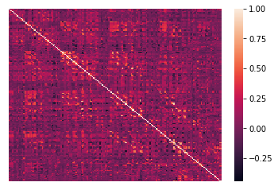
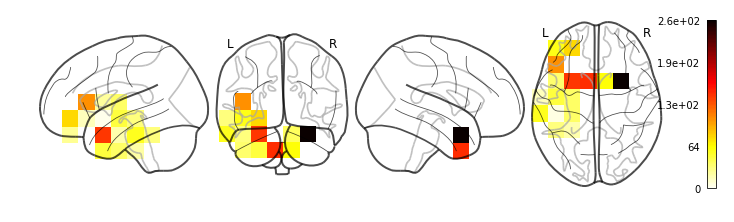

Model objects and predicting whole brain activity
=================================================

Model objects are supereeg’s class that contains the model that
reconstructs full brain activity timeseries from a smaller sample of
electrodes. The supereeg package offers a few premade models that you
can use to reconstruct brain activity, but also a way to create your own
model if you have a dataset of intracranial patient data converted into
the brain object format. This tutorial will go over how to use the
premade models included in this package, as well as make a new model
from scratch.

Load in the required libraries
==============================

.. code:: ipython2

    import supereeg as se
    import seaborn as sns
    import matplotlib.pyplot as plt
    from nilearn import plotting
    from nilearn import image
    import numpy as np

.. parsed-literal::

    /Library/Python/2.7/site-packages/sklearn/cross_validation.py:44: DeprecationWarning: This module was deprecated in version 0.18 in favor of the model_selection module into which all the refactored classes and functions are moved. Also note that the interface of the new CV iterators are different from that of this module. This module will be removed in 0.20.
      "This module will be removed in 0.20.", DeprecationWarning)

First, let’s load in our default model, ``example_model``, that we made
from the pyFR dataset sampled at 20mm resolution. Electrodes with a
threshold exceeding 10 were removed from the dataset, and the radial
basis function of with a width of 20 mm was used to ‘fill in’ nearby
electrode sites during the model creation.

.. code:: ipython2

    model = se.load('example_model')

other model options:

``pyFR_k10r20_6mm``

``pyFR_k10r20_20mm``

Note: The last option is the same as the example_model, but saved as
``.npz`` instead of ``.mo``.

Model object methods
====================

There are a few other useful methods on a brain object:

``mo.info()``
-------------

This method will give you a summary of the brain object:

.. code:: ipython2

    model.info()

.. parsed-literal::

    Number of locations: 170
    Number of subjects: 66
    Date created: Tue Dec 19 06:13:33 2017
    Meta data: None

``mo.plot()``
-------------

This method will plot your model.

The model is comprised of a number of fields. The most important are the
``model.numerator`` and ``model.denominator``. Dividing these two fields
gives a matrix of z-values, where the value in each cell represents the
covariance between every model brain location with every other model
brain location. To view the model, simply call the ``model.plot``
method. This method wraps ``seaborn.heatmap`` to plot the model
(transformed from z to r), so any arguments that ``seaborn.heatmap``
accepts are supported by ``model.plot``.

.. code:: ipython2

    model.plot(xticklabels=False, yticklabels=False)
    plt.show()

.. parsed-literal::

    /Users/lucyowen/repos/superEEG/supereeg/model.py:447: RuntimeWarning: invalid value encountered in divide
      corr_mat = z2r(np.divide(self.numerator, self.denominator))

``mo.update()``
---------------

This method allows you to update the model with addition subject data.

To do this, we can use the ``update`` method, passing a new subjects
data as a brain object. First, let’s load in an example subjects data:

.. code:: ipython2

    bo = se.load('example_data')
    bo.info()

.. parsed-literal::

    Number of electrodes: 64
    Recording time in seconds: [[  5.3984375  14.1328125]]
    Number of sessions: 2
    Date created: Wed Feb  7 08:53:06 2018
    Meta data: CH003

Now you can update the model with that brain object:

.. code:: ipython2

    updated_model = model.update(bo)
    updated_model.info()

.. parsed-literal::

    Number of locations: 170
    Number of subjects: 67
    Date created: Wed Feb  7 08:53:07 2018
    Meta data: None

Note that the model is now comprised of 67 subjects, instead of 66
before we updated it.

``mo.save(fname='something')``
------------------------------

This method will save the brain object to the specified file location.
The data will be saved as a ‘bo’ file, which is a dictionary containing
the elements of a brain object saved in the hd5 format using
``deepdish``.

.. code:: ipython2

    #mo.save(fname='model_object')

Creating a new model
--------------------

In addition to including a few premade models in the ``supereeg``
package, we also provide a way to construct a model from scratch.

Created from a list of brain objects:
~~~~~~~~~~~~~~~~~~~~~~~~~~~~~~~~~~~~~

For example, if you have a dataset of iEEG patients, we provide a way to
construct a model that will predict whole brain activity. The more
subjects you include in the model, the better it will be! To create a
model, first you’ll need to format your subject data into brain objects.
For the purpose of demonstration, we will simulate 10 subjects and
construct the model from that data:

.. code:: ipython2

    n_subs = 10
    bos = [se.simulate_bo(sample_rate=1000) for i in range(n_subs)]
    bos[0].info()

.. parsed-literal::

    Number of electrodes: 10
    Recording time in seconds: [ 1.]
    Number of sessions: 1
    Date created: Wed Feb  7 08:53:07 2018
    Meta data: None

As you can see above, each simulated subject has 10 (randomly placed)
‘electrodes’, with 1 second of data each. To construct a model from
these brain objects, simply pass them to the ``se.Model`` class, and a
new model will be generated:

.. code:: ipython2

    new_model = se.Model(bos)
    new_model.info()

.. parsed-literal::

    /Users/lucyowen/repos/superEEG/supereeg/brain.py:139: UserWarning: No sample rate given.  Number of seconds cant be computed
      warnings.warn('No sample rate given.  Number of seconds cant be computed')

.. parsed-literal::

    Number of locations: 170
    Number of subjects: 10
    Date created: Wed Feb  7 08:53:12 2018
    Meta data: None

Created by adding to model object fields:
~~~~~~~~~~~~~~~~~~~~~~~~~~~~~~~~~~~~~~~~~

Another option is to add a model directly.

You can add your model to ``model.numerator``, which comprises the sum
of the zscored correlation matrices over subjects. The
``model.denominator`` field comprises the sum of the number of subjects
contributing to each matrix cell in the ``model.numerator`` field. You
can add the locations for the model in the field ``locs`` and the number
of subjects to ``n_subs``.

In this next example, we’re constructing the model from a toeplitz
matrix with 10 subjects. We’ve updated the ``model.numerator`` field
with the toeplitz matrix created in the function, ``se.create_cov``, and
locations loaded from ``example_locations``. The ``model.denominator``
field in this case is a matrix of ones, but should be the number of
subjects that contributed to each cell in the ``model.numerator`` field.

You can also create a custom covariance matrix in ``se.create_cov`` by
simply passing numpy array as and that is number of locations by number
of locations to ``cov`` and the number of location to ``n_elecs``.

.. code:: ipython2

    locs = se.load('example_locations')
    R = se.create_cov(cov='toeplitz', n_elecs=len(locs))
    p = 10
    model = se.Model(numerator=R, denominator=np.ones(np.shape(R)), locs=locs, n_subs=p)
    model.plot(xticklabels=False, yticklabels=False)
    plt.show()

In this example we passed a numpy array of custom MNI locations to
predict.

However coordinates can also be derived by specifiying a ``template``
nifti file. By default, the model is in MNI coordinates with 20mm
resolution, but this can be easily switched to a different space using
some templates we include in the package (6mm, 8mm, 20mm), or your own
custom space (note: the model space MUST be in MNI coordinates).

.. code:: ipython2

    # new_model = se.Model(bos, template='/your/custom/MNI_template.nii')

Predicting whole brain activity
-------------------------------

``mo.predict()``
----------------

Now for the magic. ``supereeg`` uses ***gaussian process regression***
to infer whole brain activity given a smaller sampling of electrode
recordings. To predict activity, simply call the ``predict`` method of a
model and pass the subjects brain activity that you’d like to
reconstruct:

``mo.predict(nearest_neighbor=True)``
-------------------------------------

As default, the nearest voxel for each subject’s electrode location is
found and used as revised electrodes location matrix in the prediction.
If ``nearest_neighbor`` is set to ``False``, the original locations are
used in the prediction.

``mo.predict(force_update=False)``
----------------------------------

As default, the model is not updated with the subject’s correlation
matrix. By setting ``force_update`` to ``True``, you will update the
model with the subject’s correlation matrix.

.. code:: ipython2

    # plot a slice of the original data
    print('BEFORE')
    print('------')
    bo.info()
    nii = bo.to_nii()
    nii_0 = image.index_img(nii, 1)
    plotting.plot_glass_brain(nii_0, display_mode='lyrz', threshold=0, colorbar='True')
    plotting.show()
    
    # voodoo magic
    bor = model.predict(bo)
    
    
    # plot a slice of the whole brain data
    print('AFTER')
    print('------')
    bor.info()
    nii = bor.to_nii()
    nii_0 = image.index_img(nii, 1)
    plotting.plot_glass_brain(nii_0, display_mode='lyrz', threshold=0, colorbar='True')
    plotting.show()

.. parsed-literal::

    BEFORE
    ------
    Number of electrodes: 64
    Recording time in seconds: [[  5.3984375  14.1328125]]
    Number of sessions: 2
    Date created: Wed Feb  7 08:53:06 2018
    Meta data: CH003

.. parsed-literal::

    /Users/lucyowen/repos/superEEG/supereeg/brain.py:366: UserWarning: Voxel sizes of reconstruction and template do not match. Default to using a template with 20mm voxels.
      warnings.warn('Voxel sizes of reconstruction and template do not match. '
    /Users/lucyowen/repos/superEEG/supereeg/brain.py:387: UserWarning: Voxel sizes of reconstruction and template do not match. Voxel sizes calculated from model locations.
      warnings.warn('Voxel sizes of reconstruction and template do not match. '
    /Users/lucyowen/repos/superEEG/supereeg/brain.py:406: RuntimeWarning: invalid value encountered in divide
      data = np.divide(data, counts)
    /Library/Python/2.7/site-packages/matplotlib/cbook.py:136: MatplotlibDeprecationWarning: The axisbg attribute was deprecated in version 2.0. Use facecolor instead.
      warnings.warn(message, mplDeprecation, stacklevel=1)
    /Library/Python/2.7/site-packages/nilearn/plotting/glass_brain.py:164: MatplotlibDeprecationWarning: The get_axis_bgcolor function was deprecated in version 2.0. Use get_facecolor instead.
      black_bg = colors.colorConverter.to_rgba(ax.get_axis_bgcolor()) \
    /Library/Python/2.7/site-packages/matplotlib/artist.py:879: MatplotlibDeprecationWarning: The set_axis_bgcolor function was deprecated in version 2.0. Use set_facecolor instead.
      return func(v)

.. parsed-literal::

    AFTER
    ------
    Number of electrodes: 170
    Recording time in seconds: [  5.3984375  14.1328125]
    Number of sessions: 2
    Date created: Wed Feb  7 08:53:14 2018
    Meta data: None

Using the ``supereeg`` algorithm, we’ve ‘reconstructed’ whole brain
activity from a smaller sample of electrodes.
