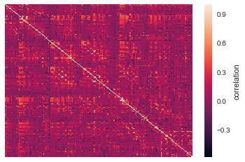

Model objects and predicting whole brain activity
=================================================

Model objects are supereeg’s class that contains the correlation model
that we use to reconstruct full-brain activity from recordings at an
impoverished set of locations. The supereeg package offers a several
pre-compiled models that you can use to reconstruct brain activity. We
also provide several ways of creating or specifying your own model. This
tutorial will review how to use the pre-made models included in this
package and make a new model from scratch.

Load in the required libraries
==============================

.. code:: ipython2

    import warnings 
    warnings.simplefilter("ignore")
    %matplotlib inline
    import supereeg as se
    import numpy as np

First, let’s load in our default model, ``example_model``, that we made
from the `pyFR
dataset <http://memory.psych.upenn.edu/Request_EEG_access?paper=SedeEtal03>`__
resampled to 20mm cubic voxels.

.. code:: ipython2

    model = se.load('example_model')

other model options: - ``pyFR_k10r20_6mm``: correlation model trained on
the pyFR dataset and resampled to 6mm cubic voxels

-  ``pyFR_k10r20_20mm``: full name of ``example_model`` (either string
   will load the same model)

Initialize model objects
========================

Model objects can be initialized by passing any of the following to the
``Model`` class instance initializer: - a path to an existing saved
model object (ending in ``.mo``) - an existing model object (this makes
a copy of the existing model object) - a ``Brain`` object or ``Nifti``
object [or paths to saved ``Brain`` objects (.bo) or ``Nifti`` objects
(.nii)] - a string corresponding to any of the `built-in example
files <http://supereeg.readthedocs.io/en/latest/supereeg.load.html#supereeg.load>`__,
of any format (any datatype may be converted to a ``Model`` object)

In addition, new model objects may be created via the ``load`` function
(which loads any of the toolbox-supported data types) and specifying
``return_type='mo'``

.. code:: ipython2

    nii_mo = se.Model('example_nifti')

Or:

.. code:: ipython2

    nii_mo = se.load('example_nifti', return_type='mo')

Model object methods
====================

There are a few other useful methods on a model object:

``mo.info()``
-------------

This method will give you a summary of the model object:

.. code:: ipython2

    model.info()

.. parsed-literal::

    Number of locations: 210
    Number of subjects: 67
    RBF width: 20
    Date created: Wed Jul 25 19:19:40 2018
    Meta data: {'stable': True}

``mo.plot_data()``
------------------

This method will plot your model.

The model is comprised of a number of fields. The most important are the
``model.numerator`` and ``model.denominator``. Dividing these two fields
gives a matrix of z-values, where the value in each cell represents the
covariance between every model brain location with every other model
brain location. To view the model, simply call the ``model.plot``
method. This method wraps ``seaborn.heatmap`` to plot the model
(transformed from z to r), so any arguments that ``seaborn.heatmap``
accepts are supported by ``model.plot``.

.. code:: ipython2

    model.plot_data(xticklabels=False, yticklabels=False)

.. parsed-literal::

    <matplotlib.axes._subplots.AxesSubplot at 0x10a1915d0>

``mo.plot_locs()``
------------------

This method will plot the locations in your model.

.. code:: ipython2

    model.plot_locs()

``mo.update()``
---------------

This method allows you to update the model with addition subject data.

To do this, we can use the ``update`` method, passing a new subjects
data as a brain object. First, let’s load in an example subjects data:

.. code:: ipython2

    bo = se.load('example_data')
    bo.info()

.. parsed-literal::

    Number of electrodes: 64
    Recording time in seconds: [ 5.3984375 14.1328125]
    Sample Rate in Hz: [256, 256]
    Number of sessions: 2
    Date created: Fri Mar  9 17:09:35 2018
    Meta data: {'patient': u'CH003'}

Now you can update the model with that brain object. This can be done
either in place using ``inplace = True``, or you can save a new updated
model:

.. code:: ipython2

    updated_model = model.update(bo, inplace=False)
    updated_model.info()

.. parsed-literal::

    Number of locations: 274
    Number of subjects: 68
    RBF width: 20
    Date created: Wed Jul 25 19:19:40 2018
    Meta data: {'stable': True}

You can also update the model by adding two model objects together.

.. code:: ipython2

    mo_bo = se.Model(bo, locs=updated_model.get_locs(), n_subs=1)
    mo_mo = se.Model(model, locs=updated_model.get_locs(), n_subs=67)
    added_model = mo_mo + mo_bo

.. code:: ipython2

    np.allclose(added_model.get_model(), updated_model.get_model())

.. parsed-literal::

    True

You can subtract models too, but once this operation is performed, you
won’t be able to update the model in the future.

.. code:: ipython2

    new_locs = se.simulate_locations(n_elecs=100)
    mo_bo = se.Model(bo, locs=new_locs, n_subs=1)
    add_model = mo_bo + mo_bo
    sub_model = add_model - mo_bo

.. code:: ipython2

    np.allclose(mo_bo.get_model(), sub_model.get_model())

.. parsed-literal::

    True

.. code:: ipython2

    try:
        assert sub_model + add_model
    except AssertionError:
        assert True == True 

Note that the model is now comprised of 67 subjects, instead of 66
before we updated it.

``mo.get_model()``
------------------

This method returns the model in the form of a correlation matrix.

.. code:: ipython2

    updated_model.get_model()

.. parsed-literal::

    array([[ 1.        , -0.09811393,  0.18961899, ...,  0.27256808,
             0.36030263,  0.25768555],
           [-0.09811393,  1.        ,  0.23203525, ...,  0.37158962,
             0.07614721, -0.01200328],
           [ 0.18961899,  0.23203525,  1.        , ...,  0.01061833,
            -0.02072749,  0.1670675 ],
           ...,
           [ 0.27256808,  0.37158962,  0.01061833, ...,  1.        ,
             0.08097902,  0.15267173],
           [ 0.36030263,  0.07614721, -0.02072749, ...,  0.08097902,
             1.        , -0.03895988],
           [ 0.25768555, -0.01200328,  0.1670675 , ...,  0.15267173,
            -0.03895988,  1.        ]])

``mo.save(fname='something')``
------------------------------

This method will save the brain object to the specified file location.
The data will be saved as a ‘bo’ file, which is a dictionary containing
the elements of a brain object saved in the hd5 format using
``deepdish``.

.. code:: ipython2

    #mo.save(fname='model_object')

Creating a new model
--------------------

In addition to including a few pre-made models in the ``supereeg``
package, we also provide a way to construct a model from scratch.

Created from a list of brain objects:
~~~~~~~~~~~~~~~~~~~~~~~~~~~~~~~~~~~~~

For example, if you have an ECoG dataset, we provide a way to construct
a model that will predict whole brain activity. The more subjects you
include in the model, the better it will be! To create a model, first
you’ll need to format your subject data into brain objects. For the
purpose of demonstration, and to highlight the “simulation” features of
the toolbox, we will generate a synthetic ECoG dataset. Specifically,
we’ll simulate data from 100 locations from each of 10 subjects and
construct the model from that data:

.. code:: ipython2

    # simulate 100 locations
    locs = se.simulate_locations(100)
    
    # simulate 10 brain objects to create a model
    n_subs = 10
    model_bos = [se.simulate_model_bos(n_samples=1000, sample_rate=1000, sample_locs=20, 
                                       locs=locs, cov='toeplitz') for x in range(n_subs)]
    
    model_bos[0].info()

.. parsed-literal::

    Number of electrodes: 20
    Recording time in seconds: [1.]
    Sample Rate in Hz: [1000]
    Number of sessions: 1
    Date created: Wed Jul 25 19:20:38 2018
    Meta data: {}

As you can see above, each simulated subject has 10 (randomly placed)
‘electrodes,’ with 1 second of data each. To construct a model from
these brain objects, simply pass them to the ``se.Model`` class, and a
new model will be generated:

.. code:: ipython2

    new_model = se.Model(data=model_bos, locs=locs)
    new_model.info()

.. parsed-literal::

    Number of locations: 100
    Number of subjects: 1
    RBF width: 20
    Date created: Wed Jul 25 19:20:39 2018
    Meta data: {'stable': True}

Created by adding to model object fields:
~~~~~~~~~~~~~~~~~~~~~~~~~~~~~~~~~~~~~~~~~

Another option is to add a model directly.

You can add your model to ``model.data`` and add the corresponding
locations for the model in the field ``locs``.

Another option, allows you to add your model to ``model.numerator``,
which comprises the sum of the z-scored correlation matrices over
subjects. The ``model.denominator`` field comprises the sum of the
number of subjects contributing to each matrix cell in the
``model.numerator`` field. You can add the locations for the model in
the field ``locs`` and the number of subjects to ``n_subs``.

In this next example, we’re constructing the model from a toeplitz
matrix with 10 subjects using 100 simulated locations. We created the
matrix using the function, ``se.create_cov`` and added it to the
``model.data`` field.

You can also create a custom covariance matrix in ``se.create_cov`` by
simply passing numpy array as and that is number of locations by number
of locations to ``cov`` and the number of location to ``n_elecs``.

.. code:: ipython2

    R = se.create_cov(cov='toeplitz', n_elecs=len(locs))
    p = 10
    toe_model = se.Model(data=R, locs=locs, n_subs=p)
    toe_model.plot_data(xticklabels=False, yticklabels=False)

.. parsed-literal::

    <matplotlib.axes._subplots.AxesSubplot at 0x10afd8150>

In this example we simulated 100 MNI locations. However coordinates can
also be derived by specifiying a ``template`` nifti file.

.. code:: ipython2

    # new_model = se.Model(bos, template='/your/custom/MNI_template.nii')

Predicting whole brain activity
-------------------------------

``mo.predict()``
----------------

Now for the magic. ``supereeg`` uses ***gaussian process regression***
to infer whole brain activity given a smaller sampling of electrode
recordings. To predict activity, simply call the ``predict`` method of a
model and pass the subjects brain activity that you’d like to
reconstruct:

``mo.predict(nearest_neighbor=True)``
-------------------------------------

As default, the nearest voxel for each subject’s electrode location is
found and used as revised electrodes location matrix in the prediction.
If ``nearest_neighbor`` is set to ``False``, the original locations are
used in the prediction.

``mo.predict(force_update=False)``
----------------------------------

As default, the model is not updated with the subject’s correlation
matrix. By setting ``force_update`` to ``True``, you will update the
model with the subject’s correlation matrix.

.. code:: ipython2

    # plot a slice of the original data
    print('BEFORE')
    print('------')
    bo.info()
    nii = bo.to_nii(template='gray', vox_size=20)
    nii.plot_glass_brain()
    
    # voodoo magic
    bor = model.predict(bo, nearest_neighbor=False, force_update=True)
    
    
    # plot a slice of the whole brain data
    print('AFTER')
    print('------')
    bor.info()
    nii = bor.to_nii(template='gray', vox_size=20)
    nii.plot_glass_brain()

.. parsed-literal::

    BEFORE
    ------
    Number of electrodes: 64
    Recording time in seconds: [ 5.3984375 14.1328125]
    Sample Rate in Hz: [256, 256]
    Number of sessions: 2
    Date created: Fri Mar  9 17:09:35 2018
    Meta data: {'patient': u'CH003'}

.. parsed-literal::

    AFTER
    ------
    Number of electrodes: 274
    Recording time in seconds: [ 5.3984375 14.1328125]
    Sample Rate in Hz: [256, 256]
    Number of sessions: 2
    Date created: Wed Jul 25 19:21:15 2018
    Meta data: {}

Using the ``supereeg`` algorithm, we’ve ‘reconstructed’ whole brain
activity from a smaller sample of electrodes.

You can plot locations of the new brain object with predicted activity.
Observed locations are in black and predicted locations are in red.

.. code:: ipython2

    bor.plot_locs()

