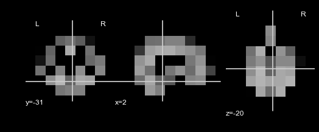

Nifti objects data type
=======================

Another option for plotting and importing/exporting data is using the
Nifti objects. Nifti objects are a subclass of the neuroimaging format
``Nibabel Nifti1Image``, which is a file that generally has the
extension “.nii” or “.nii.gz”. This allows the user to use our methods
with the Nifti class but also use other functionality such as
``Nibabel`` and ``Nilearn`` methods.

Load in the required libraries
==============================

.. code:: ipython2

    import warnings 
    warnings.simplefilter("ignore")
    %matplotlib inline
    import supereeg as se

First, let’s load in our default nifti, ``example_nifti``, that we made
from gray matter masked MNI 152 brain sampled at 6mm resolution.

.. code:: ipython2

    nii = se.load('example_nifti')

Initialize nifti objects
========================

Nifti objects can be initialized by passing a nifti object (ending in
``.nii``), but can also be initialized with a model object or brain
object by specifying ``return_type`` as ``nii``, your desired
``template`` (``gray`` or ``std``) and voxel size as ``vox_size`` in the
load function. You can also initialize a nifti object by passing a brain
object or model object to ``se.Nifti()``.

For example, you can load a brain object as a nifti object:

.. code:: ipython2

    bo_nii = se.load('example_data', return_type='nii')

Or you can:

.. code:: ipython2

    bo_nii = se.Nifti('example_data', vox_size=6)

Nifti object methods
====================

Some useful methods on a nifti object:

``nifti.info()``
----------------

This method will give you a summary of the nifti object:

.. code:: ipython2

    nii.info()

.. parsed-literal::

    Header: <class 'nibabel.nifti1.Nifti1Header'> object, endian='<'
    sizeof_hdr      : 348
    data_type       : 
    db_name         : 
    extents         : 0
    session_error   : 0
    regular         : 
    dim_info        : 0
    dim             : [ 3  9 11  9  1  1  1  1]
    intent_p1       : 0.0
    intent_p2       : 0.0
    intent_p3       : 0.0
    intent_code     : none
    datatype        : float64
    bitpix          : 64
    slice_start     : 0
    pixdim          : [ 1. 20. 20. 20.  1.  1.  1.  1.]
    vox_offset      : 0.0
    scl_slope       : nan
    scl_inter       : nan
    slice_end       : 0
    slice_code      : unknown
    xyzt_units      : 0
    cal_max         : 0.0
    cal_min         : 0.0
    slice_duration  : 0.0
    toffset         : 0.0
    glmax           : 0
    glmin           : 0
    descrip         : 
    aux_file        : 
    qform_code      : unknown
    sform_code      : aligned
    quatern_b       : 0.0
    quatern_c       : 0.0
    quatern_d       : 0.0
    qoffset_x       : -81.0
    qoffset_y       : -117.0
    qoffset_z       : -63.0
    srow_x          : [ 20.   0.   0. -81.]
    srow_y          : [   0.   20.    0. -117.]
    srow_z          : [  0.   0.  20. -63.]
    intent_name     : 
    magic           : n+1

``nifti.get_slice()``
---------------------

This method allows you to slice out images from your nifti object, and
returns the indexed nifti.

.. code:: ipython2

    nii_sliced = bo_nii.get_slice(index=[0,1,2])

``nifti.plot_glass_brain()``
----------------------------

This method will plot your nifti object.

This method wraps ``nilearn.plot_glass_brain`` to plot the nifti object,
so any arguments that ``nilearn.plot_glass_brain`` accepts are supported
by ``nifti.plot_glass_brain``.

.. code:: ipython2

    nii_sliced.plot_glass_brain()

``nifti.plot_anat()``
---------------------

This method will plot your nifti object.

This method wraps ``nilearn.plot_anat`` to plot the nifti object, so any
arguments that ``nilearn.plot_anat`` accepts are supported by
``nifti.anat``. For example, you can plot the example nifti:

.. code:: ipython2

    nii.plot_anat()

``nifti.make_gif()``
--------------------

This method will plot 4D nifti data as ``nilearn.plot_glass_brain``,
save as png files, and compile the files as gif.

This method wraps ``nilearn.plot_glass_brain`` to plot the nifti object,
so any arguments that ``nilearn.plot_glass_brain`` accepts are supported
by ``nifti.plot_glass_brain``.

.. code:: ipython2

    #nii.make_gif(gifpath='/path/to/save/gif', index=range(0, 10), name=None, **kwargs)

``nifti.save()``
----------------

This method will save your nifti object to the specified filepath
location as a ‘nii’ file.

.. code:: ipython2

    #nii.save(filepath='/path/to/save/nifti')
