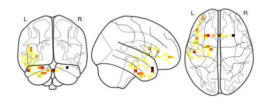

Nifti objects data type
=======================

Another option for plotting and importing/exporting data is using the
Nifti objects. Nifti objects are a subclass of the neuroimaging format
Nibabel NiftiImage, which is a file that generally has the extension
“.nii” or “.nii.gz”. This allows the user to use not only our methods
with the Nifti class but supports other functionality such as Nibabel
and Nilearn methods.

Load in the required libraries
==============================

.. code:: ipython2

    import warnings 
    warnings.simplefilter("ignore")
    %matplotlib inline
    import supereeg as se

First, let’s load in our default nifti, ``example_nifti``, that we made
from gray matter masked MNI 152 brain sampled at 6mm resolution.

.. code:: ipython2

    nii = se.load('example_nifti')

Initialize nifti objects
========================

Nifti objects can be initialized by passing a nifti object (ending in
``.nii``), but can also be initialized with a model object or brain
object by specifying ``return_type`` as ``nii``, your desired
``template`` (``gray`` or ``std``) and voxel size as ``vox_size`` in the
load function.

For example, you can load a brain object as a nifti object:

.. code:: ipython2

    bo_nii = se.load('example_data', return_type='nii')

Nifti object methods
====================

Some useful methods on a nifti object:

``nifti.info()``
----------------

This method will give you a summary of the nifti object:

.. code:: ipython2

    nii.info()

.. parsed-literal::

    Header: <class 'nibabel.nifti1.Nifti1Header'> object, endian='<'
    sizeof_hdr      : 348
    data_type       : 
    db_name         : 
    extents         : 0
    session_error   : 0
    regular         : 
    dim_info        : 0
    dim             : [ 3  9 11  9  1  1  1  1]
    intent_p1       : 0.0
    intent_p2       : 0.0
    intent_p3       : 0.0
    intent_code     : none
    datatype        : float64
    bitpix          : 64
    slice_start     : 0
    pixdim          : [ 1. 20. 20. 20.  1.  1.  1.  1.]
    vox_offset      : 0.0
    scl_slope       : nan
    scl_inter       : nan
    slice_end       : 0
    slice_code      : unknown
    xyzt_units      : 0
    cal_max         : 0.0
    cal_min         : 0.0
    slice_duration  : 0.0
    toffset         : 0.0
    glmax           : 0
    glmin           : 0
    descrip         : 
    aux_file        : 
    qform_code      : unknown
    sform_code      : aligned
    quatern_b       : 0.0
    quatern_c       : 0.0
    quatern_d       : 0.0
    qoffset_x       : -81.0
    qoffset_y       : -117.0
    qoffset_z       : -63.0
    srow_x          : [ 20.   0.   0. -81.]
    srow_y          : [   0.   20.    0. -117.]
    srow_z          : [  0.   0.  20. -63.]
    intent_name     : 
    magic           : n+1

``nifti.plot_glass_brain()``
----------------------------

This method will plot your nifti object.

This method wraps ``nilearn.plot_glass_brain`` to plot the nifti object,
so any arguments that ``nilearn.plot_glass_brain`` accepts are supported
by ``nifti.plot_glass_brain``.

.. code:: ipython2

    nii.plot_glass_brain()

.. image:: nifti_objects_files/nifti_objects_11_0.png

``nifti.plot_anat()``
---------------------

This method will plot your nifti object.

This method wraps ``nilearn.plot_anat`` to plot the nifti object, so any
arguments that ``nilearn.plot_anat`` accepts are supported by
``nifti.anat``.

.. code:: ipython2

    nii.plot_anat()

.. code:: ipython2

    #nii.make_gif
