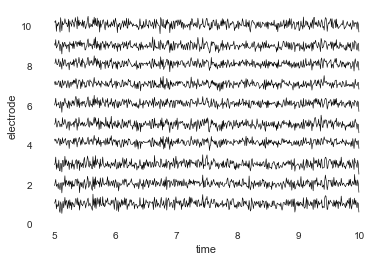
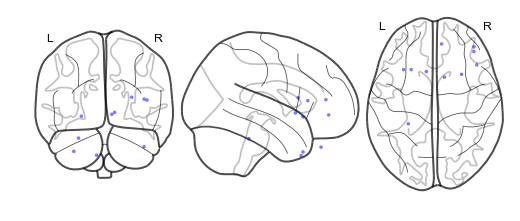
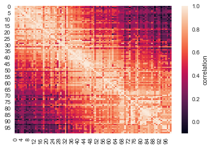
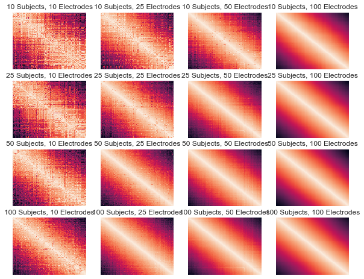
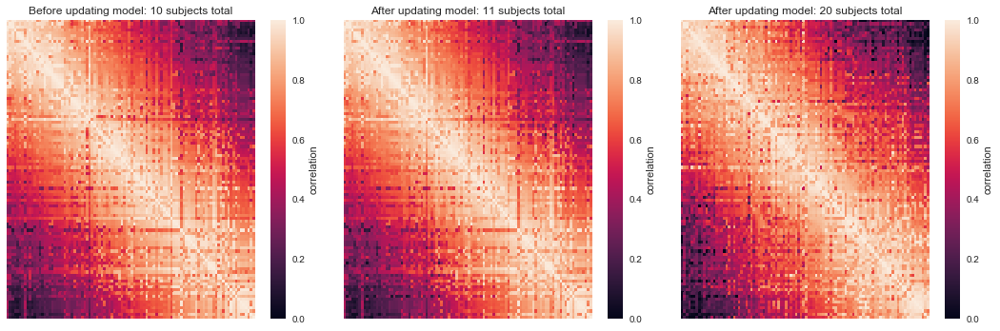
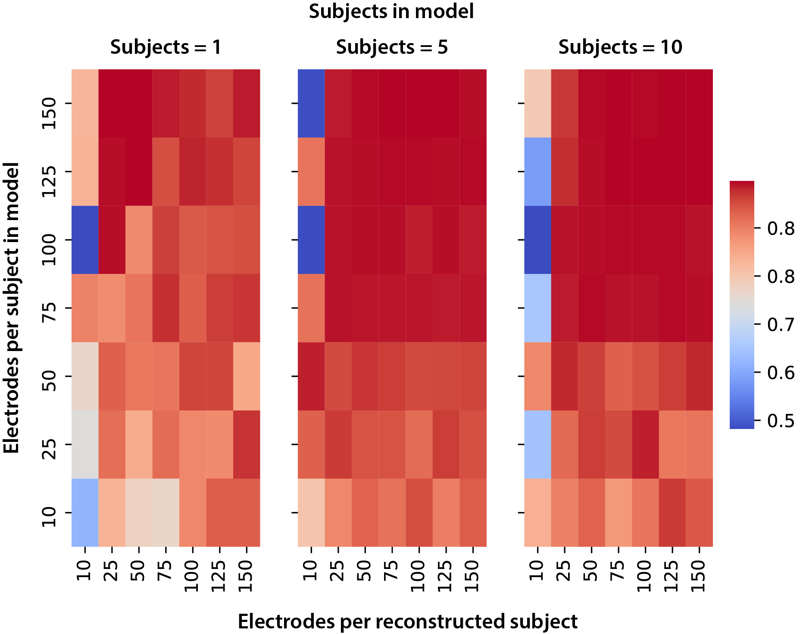

Simulate model objects and brain objects
========================================

As mentioned in the previous tutorials, you can also simulate data. You
can simulate brain objects or you can simulate a list of brain objects
to create a model. In this tutorial, we will walk you through the
simulate functions and explore varying parameters.

Load in the required libraries
==============================

.. code:: ipython2

    %matplotlib inline
    import supereeg as se
    import pandas as pd
    import seaborn as sns
    import matplotlib.pyplot as plt
    import numpy as np
    from supereeg.helpers import _corr_column

Simulate locations
==================

To begin, we can either simulate locations:

.. code:: ipython2

    sim_locs = se.simulate_locations()
    sim_locs.head()

.. raw:: html

    

    
    <table border="1" class="dataframe">
      <thead>
        <tr style="text-align: right;">
          <th></th>
          <th>x</th>
          <th>y</th>
          <th>z</th>
        </tr>
      </thead>
      <tbody>
        <tr>
          <th>0</th>
          <td>-50</td>
          <td>-14</td>
          <td>10</td>
        </tr>
        <tr>
          <th>1</th>
          <td>-46</td>
          <td>-4</td>
          <td>9</td>
        </tr>
        <tr>
          <th>2</th>
          <td>-22</td>
          <td>-40</td>
          <td>-43</td>
        </tr>
        <tr>
          <th>3</th>
          <td>-16</td>
          <td>1</td>
          <td>47</td>
        </tr>
        <tr>
          <th>4</th>
          <td>-15</td>
          <td>-29</td>
          <td>-18</td>
        </tr>
      </tbody>
    </table>
    

Or extract example locations:

Simulate brain object
=====================

``simulate_bo()``
-----------------

By default, the ``simualate_bo`` function will return a 1000 samples by
10 electrodes matrix, but you can specify the number of time samples
with ``n_samples``, sessions with ``sessions``, and the number of
electrodes with ``n_elecs`` or by passing specific electrodes with
``locs``.

.. code:: ipython2

    # simulate brain object with example locations
    bo = se.simulate_bo(n_samples=1000, sample_rate=100, sessions=2)

You can view your simulated data with ``bo.plot_data`` and simulated
locations with ``bo.plot_locs``.

.. code:: ipython2

    # for plotting data, the default time window is first 10 seconds, but you can specifiy your own window
    bo.plot_data(time_min=5, time_max=10)

.. code:: ipython2

    # plot locations
    bo.plot_locs()

Replicating simulated data with a random seed
~~~~~~~~~~~~~~~~~~~~~~~~~~~~~~~~~~~~~~~~~~~~~

We’ve added a ``random_seed=False`` and ``noise=.1`` parameters as
defaults. But if you want to recreate the same brain object, you can set
these flags to: ``random_seed=True`` and ``noise=0``

.. code:: ipython2

    # if you want to simulate the same brain object again
    bo_1 = se.simulate_bo(n_samples=1000, sessions=2, n_elecs=5, random_seed=True, noise=0).get_data()
    bo_2 = se.simulate_bo(n_samples=1000, sessions=2, n_elecs=5, random_seed=True, noise=0).get_data()
    np.allclose(bo_1, bo_2)

.. parsed-literal::

    True

Specify correlation matrix to generate simulated data
~~~~~~~~~~~~~~~~~~~~~~~~~~~~~~~~~~~~~~~~~~~~~~~~~~~~~

We use a correlation matrix to impose on the simulated subject data. The
default is ``random`` uses a positive semi-definite matrix created using
random seed. In this example we use ``cov='toeplitz'`` but options
include:

``'toeplitz'`` - toeplitz matrix

``'eye'`` - identity matrix

``'distance'`` - distance matrix

``'random'`` - positive semi-definite random matrix

.. code:: ipython2

    # simulate more locations
    locs = se.simulate_locations(n_elecs=100)
    
    # create brain object with specified correlation matrix
    bo = se.simulate_bo(n_samples=100, sample_rate=1000, locs=locs, cov='toeplitz')

You can also pass a custom covariance matrix in ``cov``.

.. code:: ipython2

    # create correlation matrix
    R = se.create_cov(cov='toeplitz', n_elecs=len(locs))
    
    R
    # and use it to create brain object
    bo = se.simulate_bo(n_samples=100, sample_rate=1000, locs=locs, cov=R)

Simulate model object
---------------------

``simulate_model_bos()``
------------------------

You can create a simulated model object by passing a list of simulated
brain objects.

.. code:: ipython2

    # list of 5 simulated brain objects, each with 20 locations, for model 
    model_bos = [se.simulate_model_bos(n_samples=100, sample_rate=1000, sample_locs=20, 
                                       locs=locs, cov=R) for x in range(5)]
    
    # create model from list of brain objects
    model = se.Model(data=model_bos, locs=locs)
    
    # plot the model
    model.plot_data()

.. parsed-literal::

    <matplotlib.axes._subplots.AxesSubplot at 0x118d3ea90>

Simulation Example 1:
---------------------

In this example we will parametrically vary how many subjects and how
many electrodes per subject are used to create the model. We loop over
number of subjects and number of randomly chosen electrodes and plot the
model at each iteration. As the figure shows, the more subjects and
electrodes, the better then recovery of the true model.

.. code:: ipython2

    # n_samples
    n_samples = 100
    
    # initialize subplots
    f, axarr = plt.subplots(4, 4)
    
    f.set_size_inches(10,8)
    
    # loop over simulated subjects size
    for isub, n_subs in enumerate([10, 25, 50, 100]):
    
        # loop over simulated electrodes
        for ielec, n_elecs in enumerate([10, 25, 50, 100]):
    
            # simulate brain objects for the model
            model_bos = [se.simulate_model_bos(n_samples=n_samples, sample_rate=10, locs=locs,
                                               sample_locs=n_elecs, cov=R) for x in range(n_subs)]
    
            # create the model object
            model = se.Model(data=model_bos, locs=locs)
    
            # plot it
            model.plot_data(ax=axarr[isub, ielec], yticklabels=False,
                        xticklabels=False, cmap='RdBu_r', cbar=False, vmin=0, vmax=1)
    
            # set the title
            axarr[isub, ielec].set_title(str(n_subs) + ' Subjects, ' + str(n_elecs) + ' Electrodes')
    
    f.tight_layout()

Simulation Example 2:
---------------------

In this example, we will simulate a model and some data, and see if we
can recover the model from the data.

First, we’ll load in some example locations. Then, we will simulate
correlational structure (a toeplitz matrix) to impose on our simulated
data. This will allow us to test whether we can recover the
correlational structure in the data, and how that changes as a function
of the number of subjects in the model. Then, we will simulate 10
subjects and create brain objects with their data.

The left figure shows the model derived from 10 simulated subjects.
Finally, we simulate 10 additional subjects and use the model.update
method to update an existing model with new data. On the right, the
updated model is plotted. As is apparent from the figures, the more data
in the model, the better the true correlational structure can be
recovered.

.. code:: ipython2

    # number of subjects
    n_subs = 10
    
    # number of electrodes
    n_elecs = 20
    
    # simulate brain objects for the model that subsample n_elecs for each synthetic patient
    model_bos = [se.simulate_model_bos(n_samples=1000, sample_rate=1000, locs=locs, sample_locs=n_elecs, cov='toeplitz') for x in
                         range(n_subs)]
    
    # create the model object
    model = se.Model(data=model_bos, locs=locs)
    
    # brain object locations subsetted entirely from both model and gray locations - for this n > m (this isn't necessarily true, but this ensures overlap)
    sub_locs = locs.sample(n_elecs).sort_values(['x', 'y', 'z'])
    
    # simulate a new brain object using the same covariance matrix
    bo = se.simulate_bo(n_samples=100, sample_rate=1000, locs=sub_locs, cov='toeplitz')
    
    # update the model
    new_model = model.update(bo)
    
    # simulate brain objects for the model that subsample n_elecs for each synthetic patient
    model_update_bos = [se.simulate_model_bos(n_samples=100, sample_rate=1000, locs=locs, sample_locs=n_elecs, cov='toeplitz') for y in
                         range(n_subs)]
    
    # update the model
    better_model = model.update(model_update_bos)
    
    # initialize subplots
    f, (ax1, ax2, ax3) = plt.subplots(1, 3)
    
    f.set_size_inches(15,5)
    
    # plot it and set the title
    model.plot_data(ax=ax1, yticklabels=False, xticklabels=False, cmap='RdBu_r', cbar=True, vmin=0, vmax=1)
    ax1.set_title('Before updating model: 10 subjects total')
    
    # plot it and set the title
    new_model.plot_data(ax=ax2, yticklabels=False, xticklabels=False, cmap='RdBu_r', cbar=True, vmin=0, vmax=1)
    ax2.set_title('After updating model: 11 subjects total')
    
    # plot it and set the title
    better_model.plot_data(ax=ax3, yticklabels=False, xticklabels=False, cmap='RdBu_r', cbar=True, vmin=0, vmax=1)
    ax3.set_title('After updating model: 20 subjects total')
    
    f.tight_layout()
    plt.show()

Simulation Example 3:
---------------------

In this example, we will loop over 3 verying parameters:

``m_patients`` - the number of subjects used to create the model

``m_elecs`` - the number of electrodes per subject used to create the
model

``n_elecs`` - the number of electrodes for the reconstructed patient

As the figure shows, the more subjects and electrodes, the better then
recovery of the true model.

.. code:: ipython2

    # # n_electrodes - number of electrodes for reconstructed patient
    # n_elecs = range(10, 160, 50)
    
    # # m_patients - number of patients in the model
    # m_patients = [5, 10]
    
    # # m_electrodes - number of electrodes for each patient in the model
    # m_elecs = range(10, 160, 50)
    
    # iter_val = 1
    
    # append_d = pd.DataFrame()
    
    # param_grid = [(p, m, n) for p in m_patients for m in m_elecs for n in n_elecs]
    
    # for p, m, n in param_grid:
    #     d = []
    
    #     for i in range(iter_val):
    #         # create brain objects with m_patients and loop over the number of model locations and subset locations to build model
    #         model_bos = [se.simulate_model_bos(n_samples=100, sample_rate=1000, locs=locs, sample_locs=m, noise =.3) for x in range(p)]
    
    #         # create model from subsampled gray locations
    #         model = se.Model(model_bos, locs=locs)
    
    #         # brain object locations subsetted entirely from both model and gray locations
    #         sub_locs = locs.sample(n).sort_values(['x', 'y', 'z'])
    
    #         # simulate brain object
    #         bo = se.simulate_bo(n_samples=100, sample_rate=1000, locs=locs, noise =.3)
    
    #         # parse brain object to create synthetic patient data
    #         data = bo.data.iloc[:, sub_locs.index]
    
    #         # create synthetic patient (will compare remaining activations to predictions)
    #         bo_sample = se.Brain(data=data.as_matrix(), locs=sub_locs)
    
    #         # reconstruct at 'unknown' locations
    #         bo_r = model.predict(bo_sample)
    
    #         # find the reconstructed indices
    #         recon_inds = [i for i, x in enumerate(bo_r.label) if x == 'reconstructed']
    
    #         # sample reconstructed data a reconstructed indices
    #         recon = bo_r.data.iloc[:, recon_inds]
    
    #         # sample actual data at reconstructed locations
    #         actual = bo.data.iloc[:, recon_inds]
    
    #         # correlate reconstruction with actual data
    #         corr_vals = _corr_column(actual.as_matrix(), recon.as_matrix())
    #         corr_vals_sample = np.random.choice(corr_vals, 5)
    
    #         d.append(
    #             {'Subjects in model': p, 'Electrodes per subject in model': m, 'Electrodes per reconstructed subject': n,
    #              'Average Correlation': corr_vals_sample.mean(), 'Correlations': corr_vals})
    
    #     d = pd.DataFrame(d, columns=['Subjects in model', 'Electrodes per subject in model',
    #                                  'Electrodes per reconstructed subject', 'Average Correlation', 'Correlations'])
    #     append_d = append_d.append(d)
    #     append_d.index.rename('Iteration', inplace=True)
    
    # new_df = append_d.groupby('Average Correlation').mean()
    
    # #fig, axs = plt.subplots(ncols=len(np.unique(new_df['Subjects in model'])), sharex=True, sharey=True)
    # fig, axs = plt.subplots(ncols=2, sharex=True, sharey=True)
    
    # axs_iter = 0
    
    # cbar_ax = fig.add_axes([.92, .3, .03, .4])
    
    # fig.subplots_adjust(right=0.85)
    # fig.set_size_inches(14,5)
    # for i in np.unique(new_df['Subjects in model']):
    #     data_plot = append_d[append_d['Subjects in model'] == i].pivot_table(index=['Electrodes per subject in model'],
    #                                                                          columns='Electrodes per reconstructed subject',
    #                                                                          values='Average Correlation')
    #     axs[axs_iter].set_title('Patients = ' + str(i))
    #     sns.heatmap(data_plot, cmap="coolwarm", cbar=axs_iter == 0, ax=axs[axs_iter], cbar_ax=None if axs_iter else cbar_ax)
    #     axs[axs_iter].invert_yaxis()
    #     axs_iter += 1
    
    # plt.show()

Simulations run on the cluster:

.. code:: ipython2

    from IPython.display import Image
    Image("simulation_for_nb.png")

